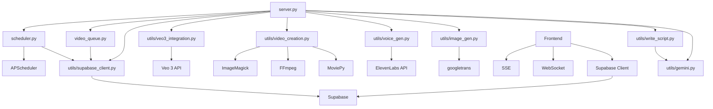

# Development Guide

## 👨‍💻 Vidzyme Development Documentation

This guide provides comprehensive information for developers working on the Vidzyme AI video generation platform, covering codebase structure, development workflows, coding standards, and contribution guidelines.

## 🏗️ Project Structure

### Repository Overview
```
Vidzyme/
├── 📁 frontend/
│   ├── src/
│   │   ├── App.tsx           # Main React application with routing
│   │   ├── components/       # React components
│   │   │   ├── Animations/   # Animation components
│   │   │   ├── Layout/       # Layout components (Header, Sidebar)
│   │   │   ├── Pages/        # Page components
│   │   │   │   ├── Dashboard.tsx      # Main dashboard
│   │   │   │   ├── VideoGenerator.tsx # Video generation interface
│   │   │   │   ├── VideoHistory.tsx   # Video history management
│   │   │   │   ├── Settings.tsx       # User settings
│   │   │   │   ├── Subscription.tsx   # Subscription management
│   │   │   │   └── Onboarding.tsx     # User onboarding flow
│   │   │   ├── Modals/       # Modal components
│   │   │   │   ├── VideoPlayerModal.tsx # Enhanced video player
│   │   │   │   └── ScheduleModal.tsx    # Video scheduling
│   │   │   └── UI/           # Reusable UI components
│   │   ├── hooks/            # Custom React hooks
│   │   │   ├── useAuth.ts    # Authentication hook
│   │   │   ├── useSupabase.ts # Supabase integration
│   │   │   └── useVideoQueue.ts # Video queue management
│   │   ├── services/         # API services and clients
│   │   │   ├── api.ts        # Main API client
│   │   │   ├── supabase.ts   # Supabase client
│   │   │   └── websocket.ts  # WebSocket client
│   │   ├── contexts/         # React contexts
│   │   │   ├── AuthContext.tsx      # Authentication context
│   │   │   └── OnboardingContext.tsx # Onboarding context
│   │   ├── config/           # Configuration files
│   │   ├── utils/            # Utility functions
│   │   └── styles/           # CSS and styling
│   ├── package.json          # Node.js dependencies
│   ├── vite.config.ts        # Vite configuration with proxy
│   └── tailwind.config.js    # Tailwind CSS config
├── 📁 backend/ (root level)
│   ├── server.py             # FastAPI main application
│   ├── scheduler.py          # Video scheduling system
│   ├── video_queue.py        # Queue management system
│   ├── requirements.txt      # Python dependencies
│   ├── config/               # Configuration files
│   │   ├── database.py       # Database configuration
│   │   └── settings.py       # Application settings
│   └── utils/                # Core utility modules
│       ├── gemini.py         # Gemini AI integration
│       ├── write_script.py   # Script generation
│       ├── image_gen.py      # Image generation
│       ├── voice_gen.py      # Voice synthesis
│       ├── video_creation.py # Video assembly
│       ├── veo3_integration.py # Veo 3 API integration
│       └── supabase_client.py  # Supabase integration
├── 📁 veo3/                  # Veo 3 API integration
│   ├── client.py             # Veo 3 client
│   └── models.py             # Veo 3 data models
├── 📁 templates/
│   └── index.html            # Simple Arabic interface
├── 📁 static/
│   ├── css/                  # Stylesheets
│   ├── images/               # Static images
│   └── js/                   # JavaScript files
├── 📁 outputs/               # Generated content
│   ├── images/               # Generated images
│   ├── audio/                # Generated audio
│   └── videos/               # Generated videos
├── 📁 logs/                  # Application logs
├── 📁 test_output/           # Test outputs
├── 📁 docs/                  # Documentation
├── 📁 tests/                 # Test files
├── README.md                 # Project overview
├── .gitignore               # Git ignore rules
├── docker-compose.yml       # Docker configuration
└── DEPLOYMENT_GUIDE.md      # Deployment instructions
```

### Module Dependencies


### Technology Stack

#### Backend Technologies
- **FastAPI**: Modern Python web framework for APIs
- **Supabase**: Database, authentication, and real-time features
- **APScheduler**: Advanced Python Scheduler for video scheduling
- **MoviePy**: Video editing and processing
- **FFmpeg**: Video/audio processing
- **ImageMagick**: Image manipulation
- **WebSocket/SSE**: Real-time communication
- **Google Gemini**: AI content generation
- **ElevenLabs**: Text-to-speech synthesis
- **Veo 3 API**: Advanced video generation
- **Pollinations AI**: Image generation

#### Frontend Technologies
- **React 18**: Modern React with hooks and context
- **TypeScript**: Type-safe JavaScript
- **Vite**: Fast build tool and dev server
- **Tailwind CSS**: Utility-first CSS framework
- **Lucide React**: Icon library
- **Heroicons**: Additional icon set
- **Supabase JS**: Client library for Supabase

#### Database & Authentication
- **Supabase PostgreSQL**: Primary database
- **Row Level Security (RLS)**: Data security
- **Real-time subscriptions**: Live data updates
- **File storage**: Video and asset storage

## 🛠️ Development Environment Setup

### 1. Prerequisites Installation

#### System Dependencies
```bash
# Install FFmpeg (required for video processing)
# Windows (using Chocolatey)
choco install ffmpeg

# macOS (using Homebrew)
brew install ffmpeg

# Ubuntu/Debian
sudo apt update && sudo apt install ffmpeg

# Install ImageMagick (required for image processing)
# Windows (using Chocolatey)
choco install imagemagick

# macOS (using Homebrew)
brew install imagemagick

# Ubuntu/Debian
sudo apt install imagemagick
```

#### Python Environment
```bash
# Install Python 3.9+
python --version  # Verify installation

# Create virtual environment
python -m venv venv

# Activate virtual environment
# Windows
venv\Scripts\activate
# macOS/Linux
source venv/bin/activate

# Upgrade pip
pip install --upgrade pip
```

#### Node.js Environment
```bash
# Install Node.js 18+
node --version  # Verify installation
npm --version   # Verify npm

# Install global tools (optional)
npm install -g typescript
npm install -g @vitejs/create-vite
```

#### Supabase Setup
1. **Create Supabase Project**:
   - Go to [supabase.com](https://supabase.com)
   - Create a new project
   - Note your project URL and anon key

2. **Database Setup**:
   ```sql
   -- Run the schema files in order:
   -- 1. supabase-schema.sql (main schema)
   -- 2. schema-extensions.sql (extensions)
   -- 3. schema-migration-platforms.sql (platform features)
   ```

### 2. Development Tools

#### Recommended IDE Setup

**Visual Studio Code Extensions**:
```json
{
  "recommendations": [
    "ms-python.python",
    "ms-python.black-formatter",
    "ms-python.flake8",
    "bradlc.vscode-tailwindcss",
    "esbenp.prettier-vscode",
    "ms-vscode.vscode-typescript-next",
    "formulahendry.auto-rename-tag",
    "christian-kohler.path-intellisense"
  ]
}
```

**VS Code Settings**:
```json
{
  "python.defaultInterpreterPath": "./venv/bin/python",
  "python.formatting.provider": "black",
  "python.linting.enabled": true,
  "python.linting.flake8Enabled": true,
  "editor.formatOnSave": true,
  "editor.codeActionsOnSave": {
    "source.organizeImports": true
  },
  "typescript.preferences.importModuleSpecifier": "relative",
  "tailwindCSS.includeLanguages": {
    "typescript": "javascript",
    "typescriptreact": "javascript"
  }
}
```

### 3. Project Setup

```bash
# Clone repository
git clone https://github.com/your-org/vidzyme.git
cd vidzyme

# Backend setup
pip install -r requirements.txt

# Frontend setup
cd frontend
npm install
cd ..

# Create necessary directories
mkdir -p outputs/images outputs/audio outputs/videos logs test_output

# Environment Variables Setup
# Backend (.env in root directory)
cat > .env << EOF
# Supabase Configuration
SUPABASE_URL=your_supabase_project_url
SUPABASE_ANON_KEY=your_supabase_anon_key
SUPABASE_SERVICE_ROLE_KEY=your_supabase_service_role_key

# API Keys
GEMINI_API_KEY=your_gemini_api_key
ELEVENLABS_API_KEY=your_elevenlabs_api_key
VEO3_API_KEY=your_veo3_api_key

# Server Configuration
HOST=127.0.0.1
PORT=8000
DEBUG=true
ENVIRONMENT=development

# File Storage
UPLOAD_DIR=outputs
MAX_FILE_SIZE=100MB
ALLOWED_EXTENSIONS=mp4,avi,mov,mkv

# Queue Configuration
MAX_CONCURRENT_GENERATIONS=3
QUEUE_TIMEOUT=1800
RETRY_ATTEMPTS=3
EOF

# Frontend (.env in frontend directory)
cat > frontend/.env << EOF
# Supabase Configuration (Frontend)
VITE_SUPABASE_URL=your_supabase_project_url
VITE_SUPABASE_ANON_KEY=your_supabase_anon_key

# API Configuration
VITE_API_BASE_URL=http://localhost:8000
VITE_WS_URL=ws://localhost:8000/ws

# Feature Flags
VITE_ENABLE_ANALYTICS=false
VITE_ENABLE_NOTIFICATIONS=true
VITE_ENABLE_SCHEDULING=true

# Development
VITE_DEBUG=true
VITE_LOG_LEVEL=debug
EOF

# Set file permissions (Unix/Linux/macOS)
chmod 600 .env frontend/.env

# Copy example files
cp frontend/.env.example frontend/.env.local
```

### 4. Database Initialization

```bash
# Run database schema setup
# 1. Go to your Supabase dashboard
# 2. Navigate to SQL Editor
# 3. Run the following files in order:

# Main schema
psql -f supabase-schema.sql

# Extensions and additional features
psql -f schema-extensions.sql

# Platform-specific features
psql -f schema-migration-platforms.sql

# Verify setup
# Check that all tables are created:
# - profiles, videos, channels, subscriptions
# - scheduled_videos, video_queue, user_settings
```

### 5. API Keys Configuration

#### Google Gemini API
1. Go to [Google AI Studio](https://makersuite.google.com/app/apikey)
2. Create a new API key
3. Add to your `.env` file as `GEMINI_API_KEY`

#### ElevenLabs API
1. Sign up at [ElevenLabs](https://elevenlabs.io)
2. Get your API key from the profile section
3. Add to your `.env` file as `ELEVENLABS_API_KEY`

#### Veo 3 API (Optional)
1. Apply for access to Google's Veo 3 API
2. Once approved, get your API key
3. Add to your `.env` file as `VEO3_API_KEY`

#### Supabase Configuration
1. Project URL: Found in your Supabase project settings
2. Anon Key: Public key for client-side operations
3. Service Role Key: Private key for server-side operations (keep secure)

## 📝 Coding Standards

### Python Code Style

#### PEP 8 Compliance
```python
# Good: Clear function names and docstrings
async def generate_video_script(topic: str, user_id: str, language: str = "ar") -> dict:
    """
    Generate video script using Gemini AI.
    
    Args:
        topic (str): Video topic or subject
        user_id (str): User ID for tracking and permissions
        language (str): Target language code (default: 'ar')
    
    Returns:
        dict: Generated script with title and content
    
    Raises:
        APIError: If Gemini API request fails
        ValueError: If topic is empty or invalid
        AuthenticationError: If user is not authenticated
    """
    if not topic.strip():
        raise ValueError("Topic cannot be empty")
    
    if not user_id:
        raise AuthenticationError("User authentication required")
    
    # Implementation here
    pass

# Good: Type hints and async/await patterns
from typing import Optional, List, Dict, Any, Union
import asyncio
from datetime import datetime

async def process_video_queue(queue_id: str) -> Dict[str, Any]:
    """Process video generation queue with proper error handling."""
    try:
        async with get_db_session() as session:
            queue_item = await session.get(VideoQueue, queue_id)
            if not queue_item:
                raise ValueError(f"Queue item {queue_id} not found")
            
            # Update status to processing
            queue_item.status = "processing"
            queue_item.started_at = datetime.utcnow()
            await session.commit()
            
            # Process video generation
            result = await generate_video_pipeline(
                topic=queue_item.topic,
                user_id=queue_item.user_id,
                settings=queue_item.settings
            )
            
            return result
            
    except Exception as e:
        logger.error(f"Queue processing failed for {queue_id}: {e}")
        await update_queue_status(queue_id, "failed", str(e))
        raise
```

#### Supabase Integration Patterns
```python
# Good: Supabase client integration
from utils.supabase_client import get_supabase_client
from supabase import Client
import asyncio

class VideoService:
    def __init__(self):
        self.supabase: Client = get_supabase_client()
    
    async def create_video_record(self, video_data: Dict[str, Any]) -> Dict[str, Any]:
        """Create video record in Supabase with proper error handling."""
        try:
            result = self.supabase.table('videos').insert(video_data).execute()
            
            if result.data:
                logger.info(f"Video record created: {result.data[0]['id']}")
                return result.data[0]
            else:
                raise ValueError("Failed to create video record")
                
        except Exception as e:
            logger.error(f"Database error creating video: {e}")
            raise DatabaseError(f"Failed to create video record: {e}")
    
    async def get_user_videos(self, user_id: str, limit: int = 20) -> List[Dict[str, Any]]:
        """Get user videos with pagination and filtering."""
        try:
            result = (
                self.supabase
                .table('videos')
                .select('*')
                .eq('user_id', user_id)
                .order('created_at', desc=True)
                .limit(limit)
                .execute()
            )
            
            return result.data or []
            
        except Exception as e:
            logger.error(f"Error fetching user videos: {e}")
            return []

# Good: Authentication middleware
from functools import wraps
from fastapi import HTTPException, Depends
from fastapi.security import HTTPBearer

security = HTTPBearer()

async def verify_token(token: str = Depends(security)) -> Dict[str, Any]:
    """Verify Supabase JWT token."""
    try:
        supabase = get_supabase_client()
        user = supabase.auth.get_user(token.credentials)
        
        if not user:
            raise HTTPException(status_code=401, detail="Invalid token")
        
        return user.user
        
    except Exception as e:
        logger.error(f"Token verification failed: {e}")
        raise HTTPException(status_code=401, detail="Authentication failed")

def require_auth(f):
    """Decorator for endpoints requiring authentication."""
    @wraps(f)
    async def wrapper(*args, **kwargs):
        user = kwargs.get('current_user')
        if not user:
            raise HTTPException(status_code=401, detail="Authentication required")
        return await f(*args, **kwargs)
    return wrapper
```

#### Error Handling Patterns
```python
# Custom exception classes
class VidzymeError(Exception):
    """Base exception for Vidzyme application."""
    pass

class APIError(VidzymeError):
    """Raised when external API calls fail."""
    def __init__(self, service: str, message: str, status_code: int = None):
        self.service = service
        self.status_code = status_code
        super().__init__(f"{service} API error: {message}")

class DatabaseError(VidzymeError):
    """Raised when database operations fail."""
    pass

class AuthenticationError(VidzymeError):
    """Raised when authentication fails."""
    pass

class ProcessingError(VidzymeError):
    """Raised when video processing fails."""
    pass

class QueueError(VidzymeError):
    """Raised when queue operations fail."""
    pass

# Usage example with proper async error handling
async def generate_video_with_retry(topic: str, user_id: str, max_retries: int = 3) -> Dict[str, Any]:
    """Generate video with retry logic and proper error handling."""
    for attempt in range(max_retries):
        try:
            # Check user permissions
            user_profile = await get_user_profile(user_id)
            if not user_profile.can_generate_video():
                raise AuthenticationError("Insufficient permissions for video generation")
            
            # Generate video
            result = await run_video_pipeline(topic, user_id)
            
            # Save to database
            video_record = await save_video_record(result, user_id)
            
            return video_record
            
        except APIError as e:
            logger.warning(f"API error on attempt {attempt + 1}: {e}")
            if attempt == max_retries - 1:
                raise
            await asyncio.sleep(2 ** attempt)  # Exponential backoff
            
        except (DatabaseError, ProcessingError) as e:
            logger.error(f"Critical error on attempt {attempt + 1}: {e}")
            raise
            
        except Exception as e:
            logger.error(f"Unexpected error on attempt {attempt + 1}: {e}")
            if attempt == max_retries - 1:
                raise ProcessingError(f"Video generation failed after {max_retries} attempts: {e}")
```

#### Logging Standards
```python
import logging
import structlog
from functools import wraps
import time

# Configure structured logging
structlog.configure(
    processors=[
        structlog.stdlib.filter_by_level,
        structlog.stdlib.add_logger_name,
        structlog.stdlib.add_log_level,
        structlog.stdlib.PositionalArgumentsFormatter(),
        structlog.processors.TimeStamper(fmt="iso"),
        structlog.processors.StackInfoRenderer(),
        structlog.processors.format_exc_info,
        structlog.processors.UnicodeDecoder(),
        structlog.processors.JSONRenderer()
    ],
    context_class=dict,
    logger_factory=structlog.stdlib.LoggerFactory(),
    wrapper_class=structlog.stdlib.BoundLogger,
    cache_logger_on_first_use=True,
)

logger = structlog.get_logger(__name__)

# Performance logging decorator
def log_performance(func):
    @wraps(func)
    async def async_wrapper(*args, **kwargs):
        start_time = time.time()
        function_name = func.__name__
        
        logger.info("function_started", function=function_name)
        
        try:
            result = await func(*args, **kwargs)
            duration = time.time() - start_time
            
            logger.info(
                "function_completed",
                function=function_name,
                duration=duration,
                success=True
            )
            
            return result
            
        except Exception as e:
            duration = time.time() - start_time
            
            logger.error(
                "function_failed",
                function=function_name,
                duration=duration,
                error=str(e),
                success=False
            )
            
            raise
    
    @wraps(func)
    def sync_wrapper(*args, **kwargs):
        start_time = time.time()
        function_name = func.__name__
        
        logger.info("function_started", function=function_name)
        
        try:
            result = func(*args, **kwargs)
            duration = time.time() - start_time
            
            logger.info(
                "function_completed",
                function=function_name,
                duration=duration,
                success=True
            )
            
            return result
            
        except Exception as e:
            duration = time.time() - start_time
            
            logger.error(
                "function_failed",
                function=function_name,
                duration=duration,
                error=str(e),
                success=False
            )
            
            raise
    
    return async_wrapper if asyncio.iscoroutinefunction(func) else sync_wrapper

# Usage
@log_performance
async def generate_images(prompts: List[str], user_id: str) -> List[str]:
    """Generate images for video segments with performance logging."""
    logger.info("image_generation_started", prompt_count=len(prompts), user_id=user_id)
    
    # Implementation
    pass
```

### TypeScript/React Code Style

#### Component Structure and Interfaces
```typescript
// Good: Comprehensive interface definitions
interface VideoGenerationSettings {
  voice: 'male' | 'female';
  language: 'ar' | 'en';
  duration?: number;
  quality?: 'standard' | 'high' | 'premium';
}

interface VideoGeneratorProps {
  onVideoGenerated?: (video: VideoData) => void;
  onError?: (error: string) => void;
  initialSettings?: Partial<VideoGenerationSettings>;
  className?: string;
  disabled?: boolean;
}

interface VideoData {
  id: string;
  title: string;
  url: string;
  thumbnail?: string;
  duration: number;
  status: 'processing' | 'completed' | 'failed';
  createdAt: string;
  userId: string;
  settings: VideoGenerationSettings;
}

// Good: Custom hook with proper typing
interface UseVideoGenerationReturn {
  generateVideo: (topic: string, settings: VideoGenerationSettings) => Promise<void>;
  isGenerating: boolean;
  progress: number;
  error: string | null;
  currentVideo: VideoData | null;
  clearError: () => void;
  cancelGeneration: () => void;
}

const useVideoGeneration = (): UseVideoGenerationReturn => {
  const [isGenerating, setIsGenerating] = useState(false);
  const [progress, setProgress] = useState(0);
  const [error, setError] = useState<string | null>(null);
  const [currentVideo, setCurrentVideo] = useState<VideoData | null>(null);
  const { user } = useAuth();
  const eventSourceRef = useRef<EventSource | null>(null);

  const generateVideo = useCallback(async (topic: string, settings: VideoGenerationSettings) => {
    if (!user) {
      setError('Authentication required');
      return;
    }

    if (!topic.trim()) {
      setError('Topic is required');
      return;
    }

    setIsGenerating(true);
    setProgress(0);
    setError(null);

    try {
      // Start video generation
      const response = await fetch('/api/generate', {
        method: 'POST',
        headers: {
          'Content-Type': 'application/json',
          'Authorization': `Bearer ${user.token}`,
        },
        body: JSON.stringify({ topic, ...settings }),
      });

      if (!response.ok) {
        const errorData = await response.json();
        throw new Error(errorData.detail || 'Generation failed');
      }

      const { video_id } = await response.json();

      // Set up SSE for progress updates
      const eventSource = new EventSource(`/api/stream?video_id=${video_id}`);
      eventSourceRef.current = eventSource;

      eventSource.onmessage = (event) => {
        const data = JSON.parse(event.data);
        
        if (data.type === 'progress') {
          setProgress(data.progress);
        } else if (data.type === 'completed') {
          setCurrentVideo(data.video);
          setIsGenerating(false);
          eventSource.close();
        } else if (data.type === 'error') {
          setError(data.message);
          setIsGenerating(false);
          eventSource.close();
        }
      };

      eventSource.onerror = () => {
        setError('Connection lost. Please try again.');
        setIsGenerating(false);
        eventSource.close();
      };

    } catch (err) {
      setError(err instanceof Error ? err.message : 'An unexpected error occurred');
      setIsGenerating(false);
    }
  }, [user]);

  const cancelGeneration = useCallback(() => {
    if (eventSourceRef.current) {
      eventSourceRef.current.close();
      eventSourceRef.current = null;
    }
    setIsGenerating(false);
    setProgress(0);
  }, []);

  const clearError = useCallback(() => {
    setError(null);
  }, []);

  useEffect(() => {
    return () => {
      if (eventSourceRef.current) {
        eventSourceRef.current.close();
      }
    };
  }, []);

  return {
    generateVideo,
    isGenerating,
    progress,
    error,
    currentVideo,
    clearError,
    cancelGeneration,
  };
};

// Good: Context with proper typing
interface AuthContextType {
  user: User | null;
  login: (email: string, password: string) => Promise<void>;
  logout: () => Promise<void>;
  signup: (email: string, password: string, userData: UserData) => Promise<void>;
  isLoading: boolean;
  error: string | null;
}

const AuthContext = createContext<AuthContextType | undefined>(undefined);

export const useAuth = (): AuthContextType => {
  const context = useContext(AuthContext);
  if (!context) {
    throw new Error('useAuth must be used within an AuthProvider');
  }
  return context;
};

// Good: Component with proper error boundaries and loading states
const VideoGenerator: React.FC<VideoGeneratorProps> = ({
  onVideoGenerated,
  onError,
  initialSettings,
  className,
  disabled = false,
}) => {
  const [topic, setTopic] = useState('');
  const [settings, setSettings] = useState<VideoGenerationSettings>({
    voice: 'female',
    language: 'ar',
    quality: 'standard',
    ...initialSettings,
  });

  const {
    generateVideo,
    isGenerating,
    progress,
    error,
    currentVideo,
    clearError,
    cancelGeneration,
  } = useVideoGeneration();

  const { user } = useAuth();

  // Form validation
  const isFormValid = useMemo(() => {
    return topic.trim().length >= 3 && topic.trim().length <= 200;
  }, [topic]);

  const handleSubmit = async (e: React.FormEvent) => {
    e.preventDefault();
    
    if (!isFormValid || disabled || isGenerating) {
      return;
    }

    try {
      await generateVideo(topic, settings);
    } catch (err) {
      const errorMessage = err instanceof Error ? err.message : 'Generation failed';
      onError?.(errorMessage);
    }
  };

  // Effect to handle successful video generation
  useEffect(() => {
    if (currentVideo) {
      onVideoGenerated?.(currentVideo);
    }
  }, [currentVideo, onVideoGenerated]);

  // Effect to handle errors
  useEffect(() => {
    if (error) {
      onError?.(error);
    }
  }, [error, onError]);

  if (!user) {
    return (
      <div className="text-center p-8">
        <p className="text-gray-600 mb-4">Please log in to generate videos</p>
        <Button variant="primary" onClick={() => window.location.href = '/login'}>
          Log In
        </Button>
      </div>
    );
  }

  return (
    <div className={cn("max-w-2xl mx-auto p-6", className)}>
      <form onSubmit={handleSubmit} className="space-y-6">
        {/* Topic Input */}
        <div>
          <label htmlFor="topic" className="block text-sm font-medium text-gray-700 mb-2">
            Video Topic
          </label>
          <textarea
            id="topic"
            value={topic}
            onChange={(e) => setTopic(e.target.value)}
            placeholder="Enter your video topic (3-200 characters)"
            className={cn(
              "w-full px-3 py-2 border rounded-md shadow-sm focus:outline-none focus:ring-2 focus:ring-blue-500",
              topic.length > 0 && !isFormValid
                ? "border-red-300 focus:border-red-500"
                : "border-gray-300 focus:border-blue-500"
            )}
            rows={3}
            disabled={disabled || isGenerating}
            maxLength={200}
          />
          <div className="flex justify-between mt-1">
            <span className={cn(
              "text-xs",
              topic.length > 0 && !isFormValid ? "text-red-500" : "text-gray-500"
            )}>
              {topic.length}/200 characters
            </span>
            {topic.length > 0 && !isFormValid && (
              <span className="text-xs text-red-500">
                Topic must be 3-200 characters
              </span>
            )}
          </div>
        </div>

        {/* Settings */}
        <div className="grid grid-cols-1 md:grid-cols-2 gap-4">
          <div>
            <label htmlFor="voice" className="block text-sm font-medium text-gray-700 mb-2">
              Voice
            </label>
            <select
              id="voice"
              value={settings.voice}
              onChange={(e) => setSettings(prev => ({ ...prev, voice: e.target.value as 'male' | 'female' }))}
              className="w-full px-3 py-2 border border-gray-300 rounded-md shadow-sm focus:outline-none focus:ring-2 focus:ring-blue-500"
              disabled={disabled || isGenerating}
            >
              <option value="female">Female</option>
              <option value="male">Male</option>
            </select>
          </div>

          <div>
            <label htmlFor="language" className="block text-sm font-medium text-gray-700 mb-2">
              Language
            </label>
            <select
              id="language"
              value={settings.language}
              onChange={(e) => setSettings(prev => ({ ...prev, language: e.target.value as 'ar' | 'en' }))}
              className="w-full px-3 py-2 border border-gray-300 rounded-md shadow-sm focus:outline-none focus:ring-2 focus:ring-blue-500"
              disabled={disabled || isGenerating}
            >
              <option value="ar">Arabic</option>
              <option value="en">English</option>
            </select>
          </div>
        </div>

        {/* Error Display */}
        {error && (
          <div className="bg-red-50 border border-red-200 rounded-md p-4">
            <div className="flex">
              <div className="flex-shrink-0">
                <ExclamationTriangleIcon className="h-5 w-5 text-red-400" />
              </div>
              <div className="ml-3">
                <p className="text-sm text-red-800">{error}</p>
                <button
                  type="button"
                  onClick={clearError}
                  className="mt-2 text-sm text-red-600 hover:text-red-500 underline"
                >
                  Dismiss
                </button>
              </div>
            </div>
          </div>
        )}

        {/* Progress Display */}
        {isGenerating && (
          <div className="bg-blue-50 border border-blue-200 rounded-md p-4">
            <div className="flex items-center justify-between mb-2">
              <span className="text-sm font-medium text-blue-800">
                Generating video...
              </span>
              <span className="text-sm text-blue-600">{Math.round(progress)}%</span>
            </div>
            <div className="w-full bg-blue-200 rounded-full h-2">
              <div
                className="bg-blue-600 h-2 rounded-full transition-all duration-300"
                style={{ width: `${progress}%` }}
              />
            </div>
            <button
              type="button"
              onClick={cancelGeneration}
              className="mt-3 text-sm text-blue-600 hover:text-blue-500 underline"
            >
              Cancel Generation
            </button>
          </div>
        )}

        {/* Submit Button */}
        <Button
          type="submit"
          variant="primary"
          size="lg"
          disabled={!isFormValid || disabled || isGenerating}
          className="w-full"
        >
          {isGenerating ? (
            <>
              <Spinner className="w-4 h-4 mr-2" />
              Generating...
            </>
          ) : (
            'Generate Video'
          )}
        </Button>
      </form>
    </div>
  );
};

export default VideoGenerator;
```

#### State Management Patterns
```typescript
// Good: Zustand store with proper typing
interface VideoStore {
  videos: VideoData[];
  currentVideo: VideoData | null;
  isLoading: boolean;
  error: string | null;
  
  // Actions
  setVideos: (videos: VideoData[]) => void;
  addVideo: (video: VideoData) => void;
  updateVideo: (id: string, updates: Partial<VideoData>) => void;
  deleteVideo: (id: string) => void;
  setCurrentVideo: (video: VideoData | null) => void;
  setLoading: (loading: boolean) => void;
  setError: (error: string | null) => void;
  
  // Async actions
  fetchVideos: (userId: string) => Promise<void>;
  generateVideo: (topic: string, settings: VideoGenerationSettings) => Promise<void>;
}

const useVideoStore = create<VideoStore>((set, get) => ({
  videos: [],
  currentVideo: null,
  isLoading: false,
  error: null,

  setVideos: (videos) => set({ videos }),
  
  addVideo: (video) => set((state) => ({
    videos: [video, ...state.videos]
  })),
  
  updateVideo: (id, updates) => set((state) => ({
    videos: state.videos.map(video => 
      video.id === id ? { ...video, ...updates } : video
    ),
    currentVideo: state.currentVideo?.id === id 
      ? { ...state.currentVideo, ...updates }
      : state.currentVideo
  })),
  
  deleteVideo: (id) => set((state) => ({
    videos: state.videos.filter(video => video.id !== id),
    currentVideo: state.currentVideo?.id === id ? null : state.currentVideo
  })),
  
  setCurrentVideo: (video) => set({ currentVideo: video }),
  setLoading: (loading) => set({ isLoading: loading }),
  setError: (error) => set({ error }),
  
  fetchVideos: async (userId) => {
    set({ isLoading: true, error: null });
    
    try {
      const response = await fetch(`/api/videos?user_id=${userId}`, {
        headers: {
          'Authorization': `Bearer ${getAuthToken()}`,
        },
      });
      
      if (!response.ok) {
        throw new Error('Failed to fetch videos');
      }
      
      const videos = await response.json();
      set({ videos, isLoading: false });
      
    } catch (error) {
      set({ 
        error: error instanceof Error ? error.message : 'Failed to fetch videos',
        isLoading: false 
      });
    }
  },
  
  generateVideo: async (topic, settings) => {
    set({ isLoading: true, error: null });
    
    try {
      const response = await fetch('/api/generate', {
        method: 'POST',
        headers: {
          'Content-Type': 'application/json',
          'Authorization': `Bearer ${getAuthToken()}`,
        },
        body: JSON.stringify({ topic, ...settings }),
      });
      
      if (!response.ok) {
        const errorData = await response.json();
        throw new Error(errorData.detail || 'Generation failed');
      }
      
      const video = await response.json();
      get().addVideo(video);
      set({ isLoading: false });
      
    } catch (error) {
      set({ 
        error: error instanceof Error ? error.message : 'Generation failed',
        isLoading: false 
      });
    }
  },
}));

// Good: React Query integration for server state
const useVideos = (userId: string) => {
  return useQuery({
    queryKey: ['videos', userId],
    queryFn: async () => {
      const response = await fetch(`/api/videos?user_id=${userId}`, {
        headers: {
          'Authorization': `Bearer ${getAuthToken()}`,
        },
      });
      
      if (!response.ok) {
        throw new Error('Failed to fetch videos');
      }
      
      return response.json();
    },
    enabled: !!userId,
    staleTime: 5 * 60 * 1000, // 5 minutes
    cacheTime: 10 * 60 * 1000, // 10 minutes
  });
};

const useVideoGeneration = () => {
  const queryClient = useQueryClient();
  
  return useMutation({
    mutationFn: async ({ topic, settings }: { topic: string; settings: VideoGenerationSettings }) => {
      const response = await fetch('/api/generate', {
        method: 'POST',
        headers: {
          'Content-Type': 'application/json',
          'Authorization': `Bearer ${getAuthToken()}`,
        },
        body: JSON.stringify({ topic, ...settings }),
      });
      
      if (!response.ok) {
        const errorData = await response.json();
        throw new Error(errorData.detail || 'Generation failed');
      }
      
      return response.json();
    },
    onSuccess: (data, variables) => {
      // Invalidate and refetch videos
      queryClient.invalidateQueries({ queryKey: ['videos'] });
      
      // Add optimistic update
      queryClient.setQueryData(['videos', data.userId], (old: VideoData[] = []) => [
        data,
        ...old
      ]);
    },
  });
};
```

#### Styling Guidelines

##### Utility-First Approach
```typescript
// Good: Utility-first with component variants
const Button: React.FC<ButtonProps> = ({ 
  variant = 'primary', 
  size = 'md', 
  loading = false,
  children, 
  className = '',
  ...props 
}) => {
  const baseClasses = 'inline-flex items-center justify-center font-medium rounded-lg transition-all duration-200 focus:outline-none focus:ring-2 focus:ring-offset-2 disabled:opacity-50 disabled:cursor-not-allowed';
  
  const variantClasses = {
    primary: 'bg-gradient-to-r from-blue-600 to-blue-700 text-white hover:from-blue-700 hover:to-blue-800 focus:ring-blue-500 shadow-lg hover:shadow-xl',
    secondary: 'bg-white text-gray-700 border border-gray-300 hover:bg-gray-50 focus:ring-gray-500 shadow-sm hover:shadow-md',
    danger: 'bg-gradient-to-r from-red-600 to-red-700 text-white hover:from-red-700 hover:to-red-800 focus:ring-red-500 shadow-lg hover:shadow-xl',
    ghost: 'text-gray-700 hover:bg-gray-100 focus:ring-gray-500'
  };
  
  const sizeClasses = {
    sm: 'px-3 py-1.5 text-sm h-8',
    md: 'px-4 py-2 text-base h-10',
    lg: 'px-6 py-3 text-lg h-12'
  };
  
  const finalClassName = `${baseClasses} ${variantClasses[variant]} ${sizeClasses[size]} ${className}`;
  
  return (
    <button 
      className={finalClassName} 
      disabled={loading || props.disabled}
      {...props}
    >
      {loading && (
        <svg className="animate-spin -ml-1 mr-2 h-4 w-4" fill="none" viewBox="0 0 24 24">
          <circle className="opacity-25" cx="12" cy="12" r="10" stroke="currentColor" strokeWidth="4" />
          <path className="opacity-75" fill="currentColor" d="M4 12a8 8 0 018-8V0C5.373 0 0 5.373 0 12h4zm2 5.291A7.962 7.962 0 014 12H0c0 3.042 1.135 5.824 3 7.938l3-2.647z" />
        </svg>
      )}
      {children}
    </button>
  );
};
```

##### Form Components
```typescript
// Input component with validation states
const Input: React.FC<InputProps> = ({ 
  label, 
  error, 
  required = false,
  className = '',
  ...props 
}) => {
  const inputClasses = `
    w-full px-3 py-2 border rounded-lg transition-colors duration-200
    focus:outline-none focus:ring-2 focus:ring-offset-1
    ${error 
      ? 'border-red-300 focus:border-red-500 focus:ring-red-500' 
      : 'border-gray-300 focus:border-blue-500 focus:ring-blue-500'
    }
    ${className}
  `;

  return (
    <div className="space-y-1">
      {label && (
        <label className="block text-sm font-medium text-gray-700">
          {label}
          {required && <span className="text-red-500 ml-1">*</span>}
        </label>
      )}
      <input className={inputClasses} {...props} />
      {error && (
        <p className="text-sm text-red-600 flex items-center">
          <ExclamationCircleIcon className="h-4 w-4 mr-1" />
          {error}
        </p>
      )}
    </div>
  );
};

// Select component
const Select: React.FC<SelectProps> = ({ 
  label, 
  options, 
  error, 
  required = false,
  ...props 
}) => (
  <div className="space-y-1">
    {label && (
      <label className="block text-sm font-medium text-gray-700">
        {label}
        {required && <span className="text-red-500 ml-1">*</span>}
      </label>
    )}
    <select 
      className={`
        w-full px-3 py-2 border rounded-lg bg-white transition-colors duration-200
        focus:outline-none focus:ring-2 focus:ring-offset-1
        ${error 
          ? 'border-red-300 focus:border-red-500 focus:ring-red-500' 
          : 'border-gray-300 focus:border-blue-500 focus:ring-blue-500'
        }
      `}
      {...props}
    >
      {options.map(option => (
        <option key={option.value} value={option.value}>
          {option.label}
        </option>
      ))}
    </select>
    {error && (
      <p className="text-sm text-red-600 flex items-center">
        <ExclamationCircleIcon className="h-4 w-4 mr-1" />
        {error}
      </p>
    )}
  </div>
);
```

##### Loading and Progress Components
```typescript
// Loading spinner
const LoadingSpinner: React.FC<{ size?: 'sm' | 'md' | 'lg' }> = ({ size = 'md' }) => {
  const sizeClasses = {
    sm: 'h-4 w-4',
    md: 'h-6 w-6',
    lg: 'h-8 w-8'
  };

  return (
    <div className="flex items-center justify-center">
      <svg 
        className={`animate-spin ${sizeClasses[size]} text-blue-600`} 
        fill="none" 
        viewBox="0 0 24 24"
      >
        <circle className="opacity-25" cx="12" cy="12" r="10" stroke="currentColor" strokeWidth="4" />
        <path className="opacity-75" fill="currentColor" d="M4 12a8 8 0 018-8V0C5.373 0 0 5.373 0 12h4zm2 5.291A7.962 7.962 0 014 12H0c0 3.042 1.135 5.824 3 7.938l3-2.647z" />
      </svg>
    </div>
  );
};

// Progress bar
const ProgressBar: React.FC<{ progress: number; label?: string }> = ({ progress, label }) => (
  <div className="space-y-2">
    {label && <p className="text-sm font-medium text-gray-700">{label}</p>}
    <div className="w-full bg-gray-200 rounded-full h-2">
      <div 
        className="bg-gradient-to-r from-blue-600 to-blue-700 h-2 rounded-full transition-all duration-300 ease-out"
        style={{ width: `${Math.min(100, Math.max(0, progress))}%` }}
      />
    </div>
    <p className="text-xs text-gray-500 text-right">{Math.round(progress)}%</p>
  </div>
);
```

##### Responsive Design Patterns
```typescript
// Responsive grid layout
const VideoGrid: React.FC<{ videos: Video[] }> = ({ videos }) => (
  <div className="grid grid-cols-1 sm:grid-cols-2 lg:grid-cols-3 xl:grid-cols-4 gap-4 md:gap-6">
    {videos.map(video => (
      <VideoCard key={video.id} video={video} />
    ))}
  </div>
);

// Responsive navigation
const Navigation: React.FC = () => (
  <nav className="bg-white shadow-sm border-b">
    <div className="max-w-7xl mx-auto px-4 sm:px-6 lg:px-8">
      <div className="flex justify-between items-center h-16">
        <div className="flex items-center space-x-4">
          <Logo className="h-8 w-auto" />
          <div className="hidden md:flex space-x-6">
            <NavLink href="/generate">Generate</NavLink>
            <NavLink href="/history">History</NavLink>
            <NavLink href="/settings">Settings</NavLink>
          </div>
        </div>
        
        {/* Mobile menu button */}
        <div className="md:hidden">
          <button className="p-2 rounded-md text-gray-400 hover:text-gray-500 hover:bg-gray-100">
            <MenuIcon className="h-6 w-6" />
          </button>
        </div>
      </div>
    </div>
  </nav>
);
```

##### Dark Mode Support
```typescript
// Dark mode toggle
const ThemeToggle: React.FC = () => {
  const [isDark, setIsDark] = useState(false);

  useEffect(() => {
    if (isDark) {
      document.documentElement.classList.add('dark');
    } else {
      document.documentElement.classList.remove('dark');
    }
  }, [isDark]);

  return (
    <button
      onClick={() => setIsDark(!isDark)}
      className="p-2 rounded-lg bg-gray-100 dark:bg-gray-800 text-gray-600 dark:text-gray-300 hover:bg-gray-200 dark:hover:bg-gray-700 transition-colors"
    >
      {isDark ? <SunIcon className="h-5 w-5" /> : <MoonIcon className="h-5 w-5" />}
    </button>
  );
};

// Dark mode aware components
const Card: React.FC<{ children: React.ReactNode }> = ({ children }) => (
  <div className="bg-white dark:bg-gray-800 rounded-lg shadow-sm dark:shadow-gray-900/20 border border-gray-200 dark:border-gray-700 p-6">
    {children}
  </div>
);
```

##### Animation and Transitions
```typescript
// Fade in animation
const FadeIn: React.FC<{ children: React.ReactNode; delay?: number }> = ({ 
  children, 
  delay = 0 
}) => (
  <div 
    className="animate-fade-in opacity-0"
    style={{ 
      animationDelay: `${delay}ms`,
      animationFillMode: 'forwards'
    }}
  >
    {children}
  </div>
);

// Slide up animation for modals
const Modal: React.FC<ModalProps> = ({ isOpen, onClose, children }) => (
  <Transition show={isOpen} as={Fragment}>
    <Dialog onClose={onClose} className="relative z-50">
      <Transition.Child
        as={Fragment}
        enter="ease-out duration-300"
        enterFrom="opacity-0"
        enterTo="opacity-100"
        leave="ease-in duration-200"
        leaveFrom="opacity-100"
        leaveTo="opacity-0"
      >
        <div className="fixed inset-0 bg-black/25 backdrop-blur-sm" />
      </Transition.Child>

      <div className="fixed inset-0 flex items-center justify-center p-4">
        <Transition.Child
          as={Fragment}
          enter="ease-out duration-300"
          enterFrom="opacity-0 scale-95"
          enterTo="opacity-100 scale-100"
          leave="ease-in duration-200"
          leaveFrom="opacity-100 scale-100"
          leaveTo="opacity-0 scale-95"
        >
          <Dialog.Panel className="bg-white dark:bg-gray-800 rounded-lg shadow-xl max-w-md w-full">
            {children}
          </Dialog.Panel>
        </Transition.Child>
      </div>
    </Dialog>
  </Transition>
);
```

##### Custom Component Patterns
```typescript
// Tabs component
const Tabs: React.FC<TabsProps> = ({ tabs, activeTab, onTabChange }) => (
  <div className="border-b border-gray-200 dark:border-gray-700">
    <nav className="-mb-px flex space-x-8">
      {tabs.map(tab => (
        <button
          key={tab.id}
          onClick={() => onTabChange(tab.id)}
          className={`
            py-2 px-1 border-b-2 font-medium text-sm transition-colors duration-200
            ${activeTab === tab.id
              ? 'border-blue-500 text-blue-600 dark:text-blue-400'
              : 'border-transparent text-gray-500 hover:text-gray-700 hover:border-gray-300 dark:text-gray-400 dark:hover:text-gray-300'
            }
          `}
        >
          {tab.label}
        </button>
      ))}
    </nav>
  </div>
);

// Toast notification
const Toast: React.FC<ToastProps> = ({ type, message, onClose }) => (
  <div className={`
    fixed top-4 right-4 z-50 p-4 rounded-lg shadow-lg max-w-sm w-full
    transform transition-all duration-300 ease-in-out
    ${type === 'success' ? 'bg-green-500' : type === 'error' ? 'bg-red-500' : 'bg-blue-500'}
    text-white
  `}>
    <div className="flex items-center justify-between">
      <p className="font-medium">{message}</p>
      <button 
        onClick={onClose}
        className="ml-4 text-white/80 hover:text-white"
      >
        <XMarkIcon className="h-5 w-5" />
      </button>
    </div>
  </div>
);
```

## 🧪 Testing Strategy

### Backend Testing

#### Unit Tests
```python
# tests/test_gemini_integration.py
import pytest
from unittest.mock import patch, Mock, AsyncMock
from utils.gemini_integration import GeminiClient, APIError
from utils.exceptions import AuthenticationError

class TestGeminiIntegration:
    
    @pytest.fixture
    def gemini_client(self):
        return GeminiClient(api_key="test_key")
    
    @patch('utils.gemini_integration.aiohttp.ClientSession.post')
    async def test_successful_query(self, mock_post, gemini_client):
        # Arrange
        mock_response = AsyncMock()
        mock_response.status = 200
        mock_response.json.return_value = {
            'candidates': [{
                'content': {'parts': [{'text': 'Generated content'}]}
            }]
        }
        mock_post.return_value.__aenter__.return_value = mock_response
        
        # Act
        result = await gemini_client.generate_script("Test prompt", "user123")
        
        # Assert
        assert result['script'] == 'Generated content'
        mock_post.assert_called_once()
    
    @patch('utils.gemini_integration.aiohttp.ClientSession.post')
    async def test_api_error_handling(self, mock_post, gemini_client):
        # Arrange
        mock_post.side_effect = Exception("API Error")
        
        # Act & Assert
        with pytest.raises(APIError):
            await gemini_client.generate_script("Test prompt", "user123")
    
    async def test_empty_prompt_validation(self, gemini_client):
        with pytest.raises(ValueError, match="Prompt cannot be empty"):
            await gemini_client.generate_script("", "user123")

# tests/test_supabase_service.py
import pytest
from unittest.mock import patch, Mock, AsyncMock
from services.video_service import VideoService
from utils.exceptions import DatabaseError, AuthenticationError

class TestVideoService:
    
    @pytest.fixture
    def video_service(self):
        return VideoService()
    
    @patch('services.video_service.supabase_client')
    async def test_create_video_record(self, mock_supabase, video_service):
        # Arrange
        mock_supabase.table.return_value.insert.return_value.execute.return_value.data = [
            {'id': 'video123', 'title': 'Test Video', 'status': 'pending'}
        ]
        
        # Act
        result = await video_service.create_video_record(
            user_id="user123",
            title="Test Video",
            prompt="Test prompt"
        )
        
        # Assert
        assert result['id'] == 'video123'
        assert result['status'] == 'pending'
    
    @patch('services.video_service.supabase_client')
    async def test_get_user_videos(self, mock_supabase, video_service):
        # Arrange
        mock_supabase.table.return_value.select.return_value.eq.return_value.execute.return_value.data = [
            {'id': 'video1', 'title': 'Video 1'},
            {'id': 'video2', 'title': 'Video 2'}
        ]
        
        # Act
        result = await video_service.get_user_videos("user123")
        
        # Assert
        assert len(result) == 2
        assert result[0]['id'] == 'video1'

# tests/test_auth_middleware.py
import pytest
from unittest.mock import patch, Mock
from fastapi import HTTPException
from auth.middleware import verify_token, require_auth

class TestAuthMiddleware:
    
    @patch('auth.middleware.supabase_client')
    async def test_valid_token(self, mock_supabase):
        # Arrange
        mock_supabase.auth.get_user.return_value.user = Mock(id="user123")
        
        # Act
        user = await verify_token("valid_token")
        
        # Assert
        assert user.id == "user123"
    
    @patch('auth.middleware.supabase_client')
    async def test_invalid_token(self, mock_supabase):
        # Arrange
        mock_supabase.auth.get_user.side_effect = Exception("Invalid token")
        
        # Act & Assert
        with pytest.raises(HTTPException) as exc_info:
            await verify_token("invalid_token")
        assert exc_info.value.status_code == 401
```

#### Integration Tests
```python
# tests/test_video_pipeline.py
import pytest
import tempfile
import os
from unittest.mock import patch, AsyncMock
from services.video_pipeline import VideoPipeline
from services.queue_service import QueueService

class TestVideoPipeline:
    
    @pytest.fixture
    def temp_output_dir(self):
        with tempfile.TemporaryDirectory() as temp_dir:
            # Set up temporary output structure
            os.makedirs(f"{temp_dir}/images", exist_ok=True)
            os.makedirs(f"{temp_dir}/audio", exist_ok=True)
            os.makedirs(f"{temp_dir}/videos", exist_ok=True)
            yield temp_dir
    
    @pytest.fixture
    def pipeline(self, temp_output_dir):
        return VideoPipeline(output_dir=temp_output_dir)
    
    @patch('services.video_pipeline.GeminiClient')
    @patch('services.video_pipeline.ImageGenerator')
    @patch('services.video_pipeline.VoiceGenerator')
    @patch('services.video_pipeline.VideoCreator')
    @patch('services.video_pipeline.Veo3Client')
    async def test_complete_pipeline(self, mock_veo3, mock_video, mock_voice, 
                                   mock_images, mock_gemini, pipeline):
        # Arrange
        mock_gemini.return_value.generate_script.return_value = {
            'script': 'Test script',
            'scenes': [{'description': 'Scene 1', 'duration': 5}]
        }
        mock_images.return_value.generate_images.return_value = ['image1.jpg']
        mock_voice.return_value.generate_voice.return_value = 'audio.mp3'
        mock_veo3.return_value.generate_video.return_value = 'video.mp4'
        
        # Act
        result = await pipeline.process_video(
            user_id="user123",
            video_id="video123",
            prompt="Test topic",
            voice_id="test_voice"
        )
        
        # Assert
        assert result['status'] == 'completed'
        assert result['video_url'] is not None
        mock_gemini.return_value.generate_script.assert_called_once()
        mock_images.return_value.generate_images.assert_called_once()
        mock_voice.return_value.generate_voice.assert_called_once()

# tests/test_queue_integration.py
import pytest
from unittest.mock import patch, AsyncMock
from services.queue_service import QueueService
from services.scheduler import VideoScheduler

class TestQueueIntegration:
    
    @pytest.fixture
    def queue_service(self):
        return QueueService()
    
    @pytest.fixture
    def scheduler(self):
        return VideoScheduler()
    
    @patch('services.queue_service.supabase_client')
    async def test_queue_video_processing(self, mock_supabase, queue_service):
        # Arrange
        mock_supabase.table.return_value.insert.return_value.execute.return_value.data = [
            {'id': 'queue123', 'video_id': 'video123', 'status': 'queued'}
        ]
        
        # Act
        result = await queue_service.add_to_queue(
            video_id="video123",
            user_id="user123",
            priority=1
        )
        
        # Assert
        assert result['status'] == 'queued'
        assert result['video_id'] == 'video123'
    
    @patch('services.scheduler.VideoPipeline')
    async def test_scheduled_processing(self, mock_pipeline, scheduler):
        # Arrange
        mock_pipeline.return_value.process_video.return_value = {
            'status': 'completed',
            'video_url': 'https://example.com/video.mp4'
        }
        
        # Act
        await scheduler.process_next_video()
        
        # Assert
        mock_pipeline.return_value.process_video.assert_called_once()
```

### Frontend Testing

#### Component Tests
```typescript
// tests/components/VideoGenerator.test.tsx
import React from 'react';
import { render, screen, fireEvent, waitFor } from '@testing-library/react';
import '@testing-library/jest-dom';
import { QueryClient, QueryClientProvider } from '@tanstack/react-query';
import { AuthProvider } from '@/contexts/AuthContext';
import VideoGenerator from '@/components/Pages/VideoGenerator';

const createTestQueryClient = () => new QueryClient({
  defaultOptions: {
    queries: { retry: false },
    mutations: { retry: false },
  },
});

const TestWrapper: React.FC<{ children: React.ReactNode }> = ({ children }) => {
  const queryClient = createTestQueryClient();
  
  return (
    <QueryClientProvider client={queryClient}>
      <AuthProvider>
        {children}
      </AuthProvider>
    </QueryClientProvider>
  );
};

describe('VideoGenerator', () => {
  beforeEach(() => {
    jest.clearAllMocks();
  });
  
  test('renders form elements correctly', () => {
    render(
      <TestWrapper>
        <VideoGenerator />
      </TestWrapper>
    );
    
    expect(screen.getByLabelText(/topic/i)).toBeInTheDocument();
    expect(screen.getByLabelText(/voice style/i)).toBeInTheDocument();
    expect(screen.getByRole('button', { name: /generate video/i })).toBeInTheDocument();
  });
  
  test('shows login prompt for unauthenticated users', () => {
    // Mock unauthenticated state
    jest.spyOn(require('@/contexts/AuthContext'), 'useAuth').mockReturnValue({
      user: null,
      loading: false,
      signIn: jest.fn(),
      signOut: jest.fn(),
    });
    
    render(
      <TestWrapper>
        <VideoGenerator />
      </TestWrapper>
    );
    
    expect(screen.getByText(/please sign in/i)).toBeInTheDocument();
  });
  
  test('validates required fields', async () => {
    // Mock authenticated state
    jest.spyOn(require('@/contexts/AuthContext'), 'useAuth').mockReturnValue({
      user: { id: 'user123', email: 'test@example.com' },
      loading: false,
      signIn: jest.fn(),
      signOut: jest.fn(),
    });
    
    render(
      <TestWrapper>
        <VideoGenerator />
      </TestWrapper>
    );
    
    const submitButton = screen.getByRole('button', { name: /generate video/i });
    fireEvent.click(submitButton);
    
    await waitFor(() => {
      expect(screen.getByText(/topic is required/i)).toBeInTheDocument();
    });
  });
  
  test('submits form with valid data', async () => {
    // Mock authenticated state
    jest.spyOn(require('@/contexts/AuthContext'), 'useAuth').mockReturnValue({
      user: { id: 'user123', email: 'test@example.com' },
      loading: false,
      signIn: jest.fn(),
      signOut: jest.fn(),
    });
    
    // Mock API call
    global.fetch = jest.fn().mockResolvedValue({
      ok: true,
      json: () => Promise.resolve({ 
        id: 'video123',
        status: 'queued',
        message: 'Video generation started'
      })
    });
    
    render(
      <TestWrapper>
        <VideoGenerator />
      </TestWrapper>
    );
    
    const topicInput = screen.getByLabelText(/topic/i);
    const submitButton = screen.getByRole('button', { name: /generate video/i });
    
    fireEvent.change(topicInput, { target: { value: 'Test topic' } });
    fireEvent.click(submitButton);
    
    await waitFor(() => {
      expect(global.fetch).toHaveBeenCalledWith(
        expect.stringContaining('/api/videos/generate'),
        expect.objectContaining({
          method: 'POST',
          headers: expect.objectContaining({
            'Content-Type': 'application/json',
            'Authorization': expect.stringContaining('Bearer'),
          }),
        })
      );
    });
  });
});

// tests/hooks/useVideoGeneration.test.tsx
import { renderHook, waitFor } from '@testing-library/react';
import { QueryClient, QueryClientProvider } from '@tanstack/react-query';
import { useVideoGeneration } from '@/hooks/useVideoGeneration';

const createTestQueryClient = () => new QueryClient({
  defaultOptions: {
    queries: { retry: false },
    mutations: { retry: false },
  },
});

describe('useVideoGeneration', () => {
  test('handles video generation successfully', async () => {
    const queryClient = createTestQueryClient();
    const wrapper = ({ children }: { children: React.ReactNode }) => (
      <QueryClientProvider client={queryClient}>
        {children}
      </QueryClientProvider>
    );
    
    global.fetch = jest.fn().mockResolvedValue({
      ok: true,
      json: () => Promise.resolve({ 
        id: 'video123',
        status: 'queued'
      })
    });
    
    const { result } = renderHook(() => useVideoGeneration(), { wrapper });
    
    await waitFor(() => {
      expect(result.current.isGenerating).toBe(false);
    });
    
    // Test generation
    result.current.generateVideo({
      topic: 'Test topic',
      voiceId: 'voice123',
      duration: 60
    });
    
    await waitFor(() => {
      expect(result.current.isGenerating).toBe(true);
    });
  });
});
```

#### E2E Tests
```typescript
// tests/e2e/video-generation.spec.ts
import { test, expect } from '@playwright/test';

test.describe('Video Generation Flow', () => {
  test.beforeEach(async ({ page }) => {
    // Mock authentication
    await page.goto('/');
    await page.evaluate(() => {
      localStorage.setItem('supabase.auth.token', JSON.stringify({
        access_token: 'mock_token',
        user: { id: 'user123', email: 'test@example.com' }
      }));
    });
  });
  
  test('complete video generation flow', async ({ page }) => {
    await page.goto('/generate');
    
    // Fill form
    await page.fill('[data-testid="topic-input"]', 'Test video topic');
    await page.selectOption('[data-testid="voice-select"]', 'voice123');
    await page.selectOption('[data-testid="duration-select"]', '60');
    
    // Mock API responses
    await page.route('**/api/videos/generate', async route => {
      await route.fulfill({
        status: 200,
        contentType: 'application/json',
        body: JSON.stringify({
          id: 'video123',
          status: 'queued',
          message: 'Video generation started'
        })
      });
    });
    
    // Submit form
    await page.click('[data-testid="generate-button"]');
    
    // Check for success message
    await expect(page.locator('[data-testid="success-message"]')).toBeVisible();
    
    // Check navigation to history
    await expect(page).toHaveURL('/history');
  });
  
  test('handles validation errors', async ({ page }) => {
    await page.goto('/generate');
    
    // Submit empty form
    await page.click('[data-testid="generate-button"]');
    
    // Check for validation errors
    await expect(page.locator('[data-testid="topic-error"]')).toBeVisible();
    await expect(page.locator('[data-testid="topic-error"]')).toContainText('Topic is required');
  });
});
```

### Test Configuration

#### Backend Test Configuration (pytest.ini)
```ini
[tool:pytest]
testpaths = tests
python_files = test_*.py
python_classes = Test*
python_functions = test_*
addopts = 
    --verbose
    --tb=short
    --cov=utils
    --cov=server
    --cov=services
    --cov=models
    --cov-report=html:htmlcov
    --cov-report=term-missing
    --cov-report=xml
    --asyncio-mode=auto
markers =
    unit: Unit tests
    integration: Integration tests
    slow: Slow running tests
    auth: Authentication tests
    queue: Queue processing tests
    video: Video generation tests
    supabase: Supabase integration tests

# Test environment variables
env = 
    TESTING=true
    SUPABASE_URL=http://localhost:54321
    SUPABASE_ANON_KEY=test_key
    GEMINI_API_KEY=test_key
    ELEVENLABS_API_KEY=test_key
    VEO3_API_KEY=test_key
```

#### Frontend Test Configuration (vitest.config.ts)
```typescript
import { defineConfig } from 'vitest/config';
import react from '@vitejs/plugin-react';
import path from 'path';

export default defineConfig({
  plugins: [react()],
  test: {
    environment: 'jsdom',
    setupFiles: ['./src/test/setup.ts'],
    globals: true,
    css: true,
    coverage: {
      provider: 'v8',
      reporter: ['text', 'json', 'html'],
      exclude: [
        'node_modules/',
        'src/test/',
        '**/*.d.ts',
        'src/main.tsx',
        'src/vite-env.d.ts',
      ],
      thresholds: {
        global: {
          branches: 70,
          functions: 70,
          lines: 70,
          statements: 70,
        },
      },
    },
  },
  resolve: {
    alias: {
      '@': path.resolve(__dirname, './src'),
    },
  },
});
```

#### E2E Test Configuration (playwright.config.ts)
```typescript
import { defineConfig, devices } from '@playwright/test';

export default defineConfig({
  testDir: './tests/e2e',
  fullyParallel: true,
  forbidOnly: !!process.env.CI,
  retries: process.env.CI ? 2 : 0,
  workers: process.env.CI ? 1 : undefined,
  reporter: 'html',
  use: {
    baseURL: 'http://localhost:5173',
    trace: 'on-first-retry',
    screenshot: 'only-on-failure',
  },
  projects: [
    {
      name: 'chromium',
      use: { ...devices['Desktop Chrome'] },
    },
    {
      name: 'firefox',
      use: { ...devices['Desktop Firefox'] },
    },
    {
      name: 'webkit',
      use: { ...devices['Desktop Safari'] },
    },
    {
      name: 'Mobile Chrome',
      use: { ...devices['Pixel 5'] },
    },
  ],
  webServer: [
    {
      command: 'npm run dev',
      port: 5173,
      cwd: './frontend',
    },
    {
      command: 'python -m uvicorn server.main:app --reload --port 8000',
      port: 8000,
      cwd: './',
    },
  ],
});
```

#### Test Scripts (package.json)
```json
{
  "scripts": {
    "test": "vitest",
    "test:ui": "vitest --ui",
    "test:run": "vitest run",
    "test:coverage": "vitest run --coverage",
    "test:e2e": "playwright test",
    "test:e2e:ui": "playwright test --ui",
    "test:backend": "cd .. && python -m pytest",
    "test:backend:coverage": "cd .. && python -m pytest --cov",
    "test:all": "npm run test:run && npm run test:backend && npm run test:e2e"
  }
}
```

## 🎬 Video Player Features

### Enhanced Video Player Modal
The application includes a sophisticated video player modal with the following features:

- **Full-screen playback** with custom controls
- **Keyboard shortcuts** for enhanced user experience
- **Auto-hide controls** for immersive viewing
- **Progress tracking** with seek functionality
- **Volume control** with mute/unmute
- **Time formatting** for current time and duration
- **Responsive design** for all screen sizes

### Video URL Handling
- **Dynamic URL fetching** from backend `/api/video-preview` endpoint
- **Fallback mechanism** to default video path
- **Proxy configuration** in Vite for seamless video serving
- **Error handling** for missing or corrupted videos

### Video History Integration
- **Search and filter** functionality for video management
- **Play button integration** with the video player modal
- **Video metadata** display and management
- **Analytics tracking** for video performance

## 🔄 Development Workflow

### Git Workflow

#### Branch Strategy
```bash
# Main branches
main          # Production-ready code
develop       # Integration branch for features

# Feature branches
feature/user-authentication
feature/video-templates
feature/batch-processing

# Release branches
release/v1.1.0

# Hotfix branches
hotfix/critical-bug-fix
```

#### Commit Message Convention
```bash
# Format: <type>(<scope>): <description>

# Types:
feat: new feature
fix: bug fix
docs: documentation changes
style: formatting, missing semicolons, etc.
refactor: code restructuring
test: adding tests
chore: maintenance tasks

# Examples:
feat(backend): add user authentication endpoint
fix(frontend): resolve video player loading issue
docs(api): update endpoint documentation
refactor(utils): optimize image generation pipeline
test(integration): add video pipeline tests
chore(deps): update dependencies to latest versions
```

#### Pull Request Template
```markdown
## Description
Brief description of changes made.

## Type of Change
- [ ] Bug fix (non-breaking change which fixes an issue)
- [ ] New feature (non-breaking change which adds functionality)
- [ ] Breaking change (fix or feature that would cause existing functionality to not work as expected)
- [ ] Documentation update

## Testing
- [ ] Unit tests pass
- [ ] Integration tests pass
- [ ] Manual testing completed
- [ ] Performance impact assessed

## Checklist
- [ ] Code follows project style guidelines
- [ ] Self-review completed
- [ ] Code is commented where necessary
- [ ] Documentation updated
- [ ] No new warnings introduced

## Screenshots (if applicable)
[Add screenshots for UI changes]

## Additional Notes
[Any additional information or context]
```

### Development Scripts

#### Backend Development
```bash
#!/bin/bash
# scripts/dev-backend.sh

# Activate virtual environment
source venv/bin/activate

# Install/update dependencies
pip install -r requirements.txt

# Run development server with auto-reload
uvicorn server:app --reload --host 127.0.0.1 --port 8000 --log-level info
```

#### Frontend Development
```bash
#!/bin/bash
# scripts/dev-frontend.sh

cd frontend

# Install/update dependencies
npm install

# Start development server
npm run dev
```

#### Testing Scripts
```bash
#!/bin/bash
# scripts/test.sh

echo "Running backend tests..."
pytest tests/ -v --cov=utils --cov=server

echo "Running frontend tests..."
cd frontend
npm test -- --coverage

echo "Running linting..."
flake8 .
cd frontend
npm run lint

echo "All tests completed!"
```

### Code Quality Tools

#### Pre-commit Hooks
```yaml
# .pre-commit-config.yaml
repos:
  - repo: https://github.com/psf/black
    rev: 22.3.0
    hooks:
      - id: black
        language_version: python3.9
  
  - repo: https://github.com/pycqa/flake8
    rev: 4.0.1
    hooks:
      - id: flake8
  
  - repo: https://github.com/pre-commit/mirrors-prettier
    rev: v2.6.2
    hooks:
      - id: prettier
        files: \.(js|ts|jsx|tsx|json|css|md)$
  
  - repo: https://github.com/pre-commit/pre-commit-hooks
    rev: v4.2.0
    hooks:
      - id: trailing-whitespace
      - id: end-of-file-fixer
      - id: check-yaml
      - id: check-json
```

#### GitHub Actions CI/CD
```yaml
# .github/workflows/ci.yml
name: CI/CD Pipeline

on:
  push:
    branches: [ main, develop ]
  pull_request:
    branches: [ main, develop ]

jobs:
  test-backend:
    runs-on: ubuntu-latest
    
    steps:
    - uses: actions/checkout@v3
    
    - name: Set up Python
      uses: actions/setup-python@v4
      with:
        python-version: '3.9'
    
    - name: Install dependencies
      run: |
        python -m pip install --upgrade pip
        pip install -r requirements.txt
        pip install pytest pytest-cov
    
    - name: Run tests
      run: |
        pytest tests/ --cov=utils --cov=server --cov-report=xml
    
    - name: Upload coverage
      uses: codecov/codecov-action@v3
      with:
        file: ./coverage.xml
  
  test-frontend:
    runs-on: ubuntu-latest
    
    steps:
    - uses: actions/checkout@v3
    
    - name: Set up Node.js
      uses: actions/setup-node@v3
      with:
        node-version: '18'
        cache: 'npm'
        cache-dependency-path: frontend/package-lock.json
    
    - name: Install dependencies
      run: |
        cd frontend
        npm ci
    
    - name: Run tests
      run: |
        cd frontend
        npm test -- --coverage --watchAll=false
    
    - name: Build
      run: |
        cd frontend
        npm run build
  
  deploy:
    needs: [test-backend, test-frontend]
    runs-on: ubuntu-latest
    if: github.ref == 'refs/heads/main'
    
    steps:
    - uses: actions/checkout@v3
    
    - name: Deploy to production
      run: |
        echo "Deploying to production..."
        # Add deployment steps here
```

## 📚 Contributing Guidelines

### Getting Started

1. **Fork the repository**
2. **Create a feature branch**: `git checkout -b feature/amazing-feature`
3. **Make your changes** following the coding standards
4. **Add tests** for new functionality
5. **Run the test suite** to ensure everything passes
6. **Commit your changes**: `git commit -m 'feat: add amazing feature'`
7. **Push to the branch**: `git push origin feature/amazing-feature`
8. **Open a Pull Request**

### Code Review Process

1. **Automated Checks**: All PRs must pass CI/CD pipeline
2. **Peer Review**: At least one team member must review
3. **Testing**: Manual testing for UI changes
4. **Documentation**: Update docs for new features
5. **Approval**: Maintainer approval required for merge

### Issue Reporting

#### Bug Report Template
```markdown
**Bug Description**
A clear description of the bug.

**Steps to Reproduce**
1. Go to '...'
2. Click on '...'
3. See error

**Expected Behavior**
What you expected to happen.

**Screenshots**
If applicable, add screenshots.

**Environment**
- OS: [e.g. Windows 10]
- Browser: [e.g. Chrome 91]
- Version: [e.g. 1.0.0]

**Additional Context**
Any other context about the problem.
```

#### Feature Request Template
```markdown
**Feature Description**
A clear description of the feature you'd like to see.

**Problem Statement**
What problem does this feature solve?

**Proposed Solution**
Describe your proposed solution.

**Alternatives Considered**
Describe alternatives you've considered.

**Additional Context**
Any other context or screenshots.
```

### Performance Guidelines

#### Backend Performance
- **API Response Time**: < 200ms for simple endpoints
- **Video Generation**: < 3 minutes for 60-second videos
- **Memory Usage**: < 2GB during processing
- **Concurrent Users**: Support 10+ simultaneous generations

#### Frontend Performance
- **First Contentful Paint**: < 1.5s
- **Largest Contentful Paint**: < 2.5s
- **Cumulative Layout Shift**: < 0.1
- **Bundle Size**: < 500KB gzipped

### Security Guidelines

#### API Security
- Never commit API keys to repository
- Use environment variables for sensitive data
- Implement rate limiting for production
- Validate all user inputs
- Use HTTPS in production

#### Frontend Security
- Sanitize user inputs
- Implement CSP headers
- Use secure authentication tokens
- Avoid storing sensitive data in localStorage

## 🚀 Deployment & Production

### Production Environment Setup

#### Environment Variables (Production)
```bash
# Backend (.env)
ENVIRONMENT=production
DEBUG=false

# Database
SUPABASE_URL=https://your-project.supabase.co
SUPABASE_ANON_KEY=your_production_anon_key
SUPABASE_SERVICE_ROLE_KEY=your_production_service_key

# API Keys
GEMINI_API_KEY=your_production_gemini_key
ELEVENLABS_API_KEY=your_production_elevenlabs_key
VEO3_API_KEY=your_production_veo3_key

# Server Configuration
HOST=0.0.0.0
PORT=8000
WORKERS=4

# File Storage
UPLOAD_DIR=/app/uploads
MAX_FILE_SIZE=100MB
ALLOWED_EXTENSIONS=mp4,avi,mov,mkv

# Queue Configuration
REDIS_URL=redis://redis:6379/0
QUEUE_MAX_SIZE=100
WORKER_CONCURRENCY=2

# Security
SECRET_KEY=your_super_secret_key_here
CORS_ORIGINS=https://yourdomain.com,https://www.yourdomain.com
```

#### Docker Configuration

**Dockerfile (Backend)**
```dockerfile
FROM python:3.9-slim

WORKDIR /app

# Install system dependencies
RUN apt-get update && apt-get install -y \
    ffmpeg \
    imagemagick \
    && rm -rf /var/lib/apt/lists/*

# Copy requirements and install Python dependencies
COPY requirements.txt .
RUN pip install --no-cache-dir -r requirements.txt

# Copy application code
COPY . .

# Create uploads directory
RUN mkdir -p uploads logs

# Expose port
EXPOSE 8000

# Run application
CMD ["uvicorn", "server.main:app", "--host", "0.0.0.0", "--port", "8000", "--workers", "4"]
```

**Dockerfile (Frontend)**
```dockerfile
FROM node:18-alpine as builder

WORKDIR /app

# Copy package files
COPY package*.json ./
RUN npm ci

# Copy source code and build
COPY . .
RUN npm run build

# Production stage
FROM nginx:alpine

# Copy built files
COPY --from=builder /app/dist /usr/share/nginx/html

# Copy nginx configuration
COPY nginx.conf /etc/nginx/nginx.conf

EXPOSE 80

CMD ["nginx", "-g", "daemon off;"]
```

**docker-compose.yml (Production)**
```yaml
version: '3.8'

services:
  backend:
    build: .
    ports:
      - "8000:8000"
    environment:
      - ENVIRONMENT=production
      - REDIS_URL=redis://redis:6379/0
    volumes:
      - ./uploads:/app/uploads
      - ./logs:/app/logs
    depends_on:
      - redis
    restart: unless-stopped

  frontend:
    build: ./frontend
    ports:
      - "80:80"
    restart: unless-stopped

  redis:
    image: redis:7-alpine
    ports:
      - "6379:6379"
    volumes:
      - redis_data:/data
    restart: unless-stopped

  worker:
    build: .
    command: python -m celery worker -A server.celery_app --loglevel=info
    environment:
      - ENVIRONMENT=production
      - REDIS_URL=redis://redis:6379/0
    volumes:
      - ./uploads:/app/uploads
      - ./logs:/app/logs
    depends_on:
      - redis
    restart: unless-stopped

volumes:
  redis_data:
```

### Monitoring & Logging

#### Structured Logging Configuration
```python
# server/logging_config.py
import structlog
import logging.config

def configure_logging():
    logging.config.dictConfig({
        "version": 1,
        "disable_existing_loggers": False,
        "formatters": {
            "json": {
                "()": structlog.stdlib.ProcessorFormatter,
                "processor": structlog.dev.ConsoleRenderer(colors=False),
            },
        },
        "handlers": {
            "default": {
                "level": "INFO",
                "class": "logging.StreamHandler",
                "formatter": "json",
            },
            "file": {
                "level": "INFO",
                "class": "logging.handlers.RotatingFileHandler",
                "filename": "logs/app.log",
                "maxBytes": 10485760,  # 10MB
                "backupCount": 5,
                "formatter": "json",
            },
        },
        "loggers": {
            "": {
                "handlers": ["default", "file"],
                "level": "INFO",
                "propagate": True,
            },
        },
    })

    structlog.configure(
        processors=[
            structlog.stdlib.filter_by_level,
            structlog.stdlib.add_logger_name,
            structlog.stdlib.add_log_level,
            structlog.stdlib.PositionalArgumentsFormatter(),
            structlog.processors.TimeStamper(fmt="iso"),
            structlog.processors.StackInfoRenderer(),
            structlog.processors.format_exc_info,
            structlog.processors.UnicodeDecoder(),
            structlog.processors.JSONRenderer()
        ],
        context_class=dict,
        logger_factory=structlog.stdlib.LoggerFactory(),
        wrapper_class=structlog.stdlib.BoundLogger,
        cache_logger_on_first_use=True,
    )
```

#### Health Check Endpoints
```python
# server/health.py
from fastapi import APIRouter, HTTPException
from datetime import datetime
import psutil
import redis
from supabase import create_client

router = APIRouter()

@router.get("/health")
async def health_check():
    """Basic health check endpoint"""
    return {
        "status": "healthy",
        "timestamp": datetime.utcnow().isoformat(),
        "version": "1.0.0"
    }

@router.get("/health/detailed")
async def detailed_health_check():
    """Detailed health check with dependencies"""
    checks = {}
    
    # Database check
    try:
        supabase = create_client(
            os.getenv("SUPABASE_URL"),
            os.getenv("SUPABASE_ANON_KEY")
        )
        result = supabase.table("videos").select("id").limit(1).execute()
        checks["database"] = "healthy"
    except Exception as e:
        checks["database"] = f"unhealthy: {str(e)}"
    
    # Redis check
    try:
        r = redis.from_url(os.getenv("REDIS_URL"))
        r.ping()
        checks["redis"] = "healthy"
    except Exception as e:
        checks["redis"] = f"unhealthy: {str(e)}"
    
    # System resources
    checks["cpu_percent"] = psutil.cpu_percent()
    checks["memory_percent"] = psutil.virtual_memory().percent
    checks["disk_percent"] = psutil.disk_usage('/').percent
    
    # Overall status
    overall_status = "healthy" if all(
        check == "healthy" for check in [checks["database"], checks["redis"]]
    ) else "unhealthy"
    
    return {
        "status": overall_status,
        "timestamp": datetime.utcnow().isoformat(),
        "checks": checks
    }
```

#### Prometheus Metrics
```python
# server/metrics.py
from prometheus_client import Counter, Histogram, Gauge, generate_latest
from fastapi import Response
import time

# Metrics
REQUEST_COUNT = Counter('http_requests_total', 'Total HTTP requests', ['method', 'endpoint', 'status'])
REQUEST_DURATION = Histogram('http_request_duration_seconds', 'HTTP request duration')
VIDEO_GENERATION_COUNT = Counter('video_generations_total', 'Total video generations', ['status'])
VIDEO_GENERATION_DURATION = Histogram('video_generation_duration_seconds', 'Video generation duration')
ACTIVE_USERS = Gauge('active_users', 'Number of active users')
QUEUE_SIZE = Gauge('queue_size', 'Current queue size')

@router.get("/metrics")
async def metrics():
    """Prometheus metrics endpoint"""
    return Response(generate_latest(), media_type="text/plain")

# Middleware for request metrics
@app.middleware("http")
async def metrics_middleware(request: Request, call_next):
    start_time = time.time()
    
    response = await call_next(request)
    
    duration = time.time() - start_time
    REQUEST_DURATION.observe(duration)
    REQUEST_COUNT.labels(
        method=request.method,
        endpoint=request.url.path,
        status=response.status_code
    ).inc()
    
    return response
```

### Performance Optimization

#### Backend Optimizations
```python
# server/optimizations.py
from functools import lru_cache
import asyncio
from concurrent.futures import ThreadPoolExecutor

# Cache frequently accessed data
@lru_cache(maxsize=128)
def get_voice_options():
    """Cache voice options to avoid repeated API calls"""
    return fetch_voice_options_from_api()

# Async processing for I/O bound operations
async def process_video_batch(video_requests):
    """Process multiple videos concurrently"""
    semaphore = asyncio.Semaphore(5)  # Limit concurrent processing
    
    async def process_single_video(request):
        async with semaphore:
            return await generate_video(request)
    
    tasks = [process_single_video(req) for req in video_requests]
    return await asyncio.gather(*tasks, return_exceptions=True)

# Thread pool for CPU-bound operations
executor = ThreadPoolExecutor(max_workers=4)

async def cpu_intensive_task(data):
    """Run CPU-intensive tasks in thread pool"""
    loop = asyncio.get_event_loop()
    return await loop.run_in_executor(executor, process_data, data)
```

#### Frontend Optimizations
```typescript
// src/utils/performance.ts
import { lazy, Suspense } from 'react';

// Code splitting for large components
const VideoGenerator = lazy(() => import('@/components/Pages/VideoGenerator'));
const VideoHistory = lazy(() => import('@/components/Pages/VideoHistory'));

// Memoization for expensive calculations
export const memoizedVideoProcessor = useMemo(() => {
  return createVideoProcessor(settings);
}, [settings]);

// Virtual scrolling for large lists
import { FixedSizeList as List } from 'react-window';

export const VirtualizedVideoList: React.FC<{ videos: Video[] }> = ({ videos }) => {
  const Row = ({ index, style }: { index: number; style: React.CSSProperties }) => (
    <div style={style}>
      <VideoCard video={videos[index]} />
    </div>
  );

  return (
    <List
      height={600}
      itemCount={videos.length}
      itemSize={120}
      width="100%"
    >
      {Row}
    </List>
  );
};

// Image optimization
export const OptimizedImage: React.FC<{ src: string; alt: string }> = ({ src, alt }) => {
  return (
    
  );
};
```

### Security Hardening

#### Backend Security
```python
# server/security.py
from fastapi import HTTPException, Depends
from fastapi.security import HTTPBearer
import jwt
import bcrypt
from datetime import datetime, timedelta

security = HTTPBearer()

class SecurityConfig:
    SECRET_KEY = os.getenv("SECRET_KEY")
    ALGORITHM = "HS256"
    ACCESS_TOKEN_EXPIRE_MINUTES = 30
    RATE_LIMIT_PER_MINUTE = 60

# Rate limiting
from slowapi import Limiter, _rate_limit_exceeded_handler
from slowapi.util import get_remote_address
from slowapi.errors import RateLimitExceeded

limiter = Limiter(key_func=get_remote_address)
app.state.limiter = limiter
app.add_exception_handler(RateLimitExceeded, _rate_limit_exceeded_handler)

@app.post("/api/videos/generate")
@limiter.limit("5/minute")
async def generate_video_endpoint(request: Request, ...):
    # Rate limited endpoint
    pass

# Input validation
from pydantic import BaseModel, validator

class VideoRequest(BaseModel):
    topic: str
    duration: int
    voice_id: str
    
    @validator('topic')
    def validate_topic(cls, v):
        if len(v) < 3 or len(v) > 200:
            raise ValueError('Topic must be between 3 and 200 characters')
        return v.strip()
    
    @validator('duration')
    def validate_duration(cls, v):
        if v not in [30, 60, 90, 120]:
            raise ValueError('Duration must be 30, 60, 90, or 120 seconds')
        return v

# CORS configuration
from fastapi.middleware.cors import CORSMiddleware

app.add_middleware(
    CORSMiddleware,
    allow_origins=os.getenv("CORS_ORIGINS", "").split(","),
    allow_credentials=True,
    allow_methods=["GET", "POST", "PUT", "DELETE"],
    allow_headers=["*"],
)
```

#### Frontend Security
```typescript
// src/utils/security.ts
import DOMPurify from 'dompurify';

// Sanitize user inputs
export const sanitizeInput = (input: string): string => {
  return DOMPurify.sanitize(input, { ALLOWED_TAGS: [] });
};

// Secure token storage
export const tokenStorage = {
  set: (token: string) => {
    // Use httpOnly cookies in production
    if (process.env.NODE_ENV === 'production') {
      document.cookie = `auth_token=${token}; Secure; HttpOnly; SameSite=Strict`;
    } else {
      localStorage.setItem('auth_token', token);
    }
  },
  
  get: (): string | null => {
    if (process.env.NODE_ENV === 'production') {
      // Extract from httpOnly cookie
      return extractTokenFromCookie();
    }
    return localStorage.getItem('auth_token');
  },
  
  remove: () => {
    if (process.env.NODE_ENV === 'production') {
      document.cookie = 'auth_token=; expires=Thu, 01 Jan 1970 00:00:00 UTC; path=/;';
    } else {
      localStorage.removeItem('auth_token');
    }
  }
};

// Content Security Policy
export const cspHeaders = {
  'Content-Security-Policy': [
    "default-src 'self'",
    "script-src 'self' 'unsafe-inline'",
    "style-src 'self' 'unsafe-inline' https://fonts.googleapis.com",
    "font-src 'self' https://fonts.gstatic.com",
    "img-src 'self' data: https:",
    "media-src 'self' blob:",
    "connect-src 'self' https://api.supabase.co wss://api.supabase.co"
  ].join('; ')
};
```

This comprehensive deployment and production section ensures that the Vidzyme application can be deployed securely and efficiently, with proper monitoring, logging, and performance optimization in place.

## 📚 Contributing Guidelines

### Getting Started

1. **Fork the repository**
2. **Create a feature branch**: `git checkout -b feature/amazing-feature`
3. **Make your changes** following the coding standards
4. **Add tests** for new functionality
5. **Run the test suite** to ensure everything passes
6. **Commit your changes**: `git commit -m 'feat: add amazing feature'`
7. **Push to the branch**: `git push origin feature/amazing-feature`
8. **Open a Pull Request**

### Code Review Process

1. **Automated Checks**: All PRs must pass CI/CD pipeline
2. **Peer Review**: At least one team member must review
3. **Testing**: Manual testing for UI changes
4. **Documentation**: Update docs for new features
5. **Approval**: Maintainer approval required for merge

### Issue Reporting

#### Bug Report Template
```markdown
**Bug Description**
A clear description of the bug.

**Steps to Reproduce**
1. Go to '...'
2. Click on '...'
3. See error

**Expected Behavior**
What you expected to happen.

**Screenshots**
If applicable, add screenshots.

**Environment**
- OS: [e.g. Windows 10]
- Browser: [e.g. Chrome 91]
- Version: [e.g. 1.0.0]

**Additional Context**
Any other context about the problem.
```

#### Feature Request Template
```markdown
**Feature Description**
A clear description of the feature you'd like to see.

**Problem Statement**
What problem does this feature solve?

**Proposed Solution**
Describe your proposed solution.

**Alternatives Considered**
Describe alternatives you've considered.

**Additional Context**
Any other context or screenshots.
```

### Performance Guidelines

#### Backend Performance
- **API Response Time**: < 200ms for simple endpoints
- **Video Generation**: < 3 minutes for 60-second videos
- **Memory Usage**: < 2GB during processing
- **Concurrent Users**: Support 10+ simultaneous generations

#### Frontend Performance
- **First Contentful Paint**: < 1.5s
- **Largest Contentful Paint**: < 2.5s
- **Cumulative Layout Shift**: < 0.1
- **Bundle Size**: < 500KB gzipped

### Security Guidelines

#### API Security
- Never commit API keys to repository
- Use environment variables for sensitive data
- Implement rate limiting for production
- Validate all user inputs
- Use HTTPS in production

#### Frontend Security
- Sanitize user inputs
- Implement CSP headers
- Use secure authentication tokens
- Avoid storing sensitive data in localStorage

This development guide provides a comprehensive foundation for contributing to the Vidzyme project, ensuring code quality, consistency, and maintainability across the entire codebase.