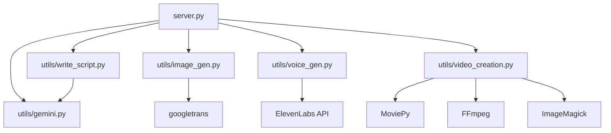

# Development Guide

## 👨‍💻 Vidzyme Development Documentation

This guide provides comprehensive information for developers working on the Vidzyme AI video generation platform, covering codebase structure, development workflows, coding standards, and contribution guidelines.

## 🏗️ Project Structure

### Repository Overview
```
Vidzyme/
├── � backend/
│   ├── server.py              # FastAPI main application
│   ├── requirements.txt       # Python dependencies
│   └── utils/                 # Core utility modules
│       ├── gemini.py         # Gemini AI integration
│       ├── write_script.py   # Script generation
│       ├── image_gen.py      # Image generation
│       ├── voice_gen.py      # Voice synthesis
│       └── video_creation.py # Video assembly
├── 📁 frontend/
│   ├── src/
│   │   ├── App.tsx           # Main React application
│   │   ├── components/       # React components
│   │   │   ├── Animations/   # Animation components
│   │   │   ├── Layout/       # Layout components
│   │   │   └── Pages/        # Page components
│   │   └── styles/           # CSS and styling
│   ├── package.json          # Node.js dependencies
│   ├── vite.config.ts        # Vite configuration
│   └── tailwind.config.js    # Tailwind CSS config
├── 📁 templates/
│   └── index.html            # Simple Arabic interface
├── 📁 static/
│   ├── css/                  # Stylesheets
│   ├── images/               # Static images
│   └── js/                   # JavaScript files
├── 📁 outputs/               # Generated content
│   ├── images/               # Generated images
│   ├── audio/                # Generated audio
│   └── youtube_short.mp4     # Final video output
├── 📁 docs/                  # Documentation
├── 📁 tests/                 # Test files
├── README.md                 # Project overview
├── .gitignore               # Git ignore rules
└── docker-compose.yml       # Docker configuration
```

### Module Dependencies


## 🛠️ Development Environment Setup

### 1. Prerequisites Installation

#### Python Environment
```bash
# Install Python 3.9+
python --version  # Verify installation

# Create virtual environment
python -m venv venv

# Activate virtual environment
# Windows
venv\Scripts\activate
# macOS/Linux
source venv/bin/activate

# Upgrade pip
pip install --upgrade pip
```

#### Node.js Environment
```bash
# Install Node.js 16+
node --version  # Verify installation
npm --version   # Verify npm

# Install global tools
npm install -g typescript
npm install -g @vitejs/create-vite
```

### 2. Development Tools

#### Recommended IDE Setup

**Visual Studio Code Extensions**:
```json
{
  "recommendations": [
    "ms-python.python",
    "ms-python.black-formatter",
    "ms-python.flake8",
    "bradlc.vscode-tailwindcss",
    "esbenp.prettier-vscode",
    "ms-vscode.vscode-typescript-next",
    "formulahendry.auto-rename-tag",
    "christian-kohler.path-intellisense"
  ]
}
```

**VS Code Settings**:
```json
{
  "python.defaultInterpreterPath": "./venv/bin/python",
  "python.formatting.provider": "black",
  "python.linting.enabled": true,
  "python.linting.flake8Enabled": true,
  "editor.formatOnSave": true,
  "editor.codeActionsOnSave": {
    "source.organizeImports": true
  },
  "typescript.preferences.importModuleSpecifier": "relative",
  "tailwindCSS.includeLanguages": {
    "typescript": "javascript",
    "typescriptreact": "javascript"
  }
}
```

### 3. Project Setup

```bash
# Clone repository
git clone https://github.com/your-org/vidzyme.git
cd vidzyme

# Backend setup
pip install -r requirements.txt

# Frontend setup
cd frontend
npm install
cd ..

# Create necessary directories
mkdir -p outputs/images outputs/audio logs tests

# Set up API keys (development)
echo "your_development_gemini_key" > gemini_secret.txt
echo "your_development_elevenlabs_key" > voice_secret.txt

# Set file permissions
chmod 600 *.txt
```

## 📝 Coding Standards

### Python Code Style

#### PEP 8 Compliance
```python
# Good: Clear function names and docstrings
def generate_video_script(topic: str, language: str = "ar") -> dict:
    """
    Generate video script using Gemini AI.
    
    Args:
        topic (str): Video topic or subject
        language (str): Target language code (default: 'ar')
    
    Returns:
        dict: Generated script with title and content
    
    Raises:
        APIError: If Gemini API request fails
        ValueError: If topic is empty or invalid
    """
    if not topic.strip():
        raise ValueError("Topic cannot be empty")
    
    # Implementation here
    pass

# Good: Type hints and error handling
from typing import Optional, List, Dict, Any

def process_text_segments(text: str) -> List[str]:
    """Split text into processable segments."""
    segments = []
    for line in text.split('\n'):
        cleaned = line.strip()
        if cleaned:
            segments.append(cleaned)
    return segments
```

#### Error Handling Patterns
```python
# Custom exception classes
class VidzymeError(Exception):
    """Base exception for Vidzyme application."""
    pass

class APIError(VidzymeError):
    """Raised when external API calls fail."""
    def __init__(self, service: str, message: str, status_code: int = None):
        self.service = service
        self.status_code = status_code
        super().__init__(f"{service} API error: {message}")

class ProcessingError(VidzymeError):
    """Raised when video processing fails."""
    pass

# Usage example
try:
    response = gemini.query(prompt)
except requests.RequestException as e:
    raise APIError("Gemini", str(e), getattr(e.response, 'status_code', None))
except Exception as e:
    logger.error(f"Unexpected error in script generation: {e}")
    raise ProcessingError(f"Script generation failed: {e}")
```

#### Logging Standards
```python
import logging
from functools import wraps

# Configure logging
logging.basicConfig(
    level=logging.INFO,
    format='%(asctime)s - %(name)s - %(levelname)s - %(message)s'
)
logger = logging.getLogger(__name__)

# Logging decorator
def log_function_call(func):
    @wraps(func)
    def wrapper(*args, **kwargs):
        logger.info(f"Calling {func.__name__} with args: {args[:2]}...")  # Truncate for privacy
        try:
            result = func(*args, **kwargs)
            logger.info(f"{func.__name__} completed successfully")
            return result
        except Exception as e:
            logger.error(f"{func.__name__} failed: {e}")
            raise
    return wrapper

# Usage
@log_function_call
def generate_images(prompts: List[str]) -> List[str]:
    """Generate images for video segments."""
    # Implementation
    pass
```

### TypeScript/React Code Style

#### Component Structure
```typescript
// Good: Proper TypeScript interface and component structure
import React, { useState, useEffect } from 'react';
import { Loader2, Play, Download } from 'lucide-react';

interface VideoGeneratorProps {
  onNavigate: (page: string) => void;
  onVideoGenerated?: (videoData: VideoData) => void;
}

interface VideoData {
  id: string;
  title: string;
  duration: number;
  filePath: string;
  createdAt: Date;
}

interface FormData {
  topic: string;
  voiceStyle: string;
  videoLength: number;
  platforms: string[];
}

const VideoGenerator: React.FC<VideoGeneratorProps> = ({ 
  onNavigate, 
  onVideoGenerated 
}) => {
  const [formData, setFormData] = useState<FormData>({
    topic: '',
    voiceStyle: 'هيثم',
    videoLength: 30,
    platforms: []
  });
  
  const [isGenerating, setIsGenerating] = useState<boolean>(false);
  const [progress, setProgress] = useState<number>(0);
  const [errors, setErrors] = useState<Record<string, string>>({});

  // Event handlers
  const handleInputChange = (field: keyof FormData, value: any) => {
    setFormData(prev => ({ ...prev, [field]: value }));
    // Clear field error when user starts typing
    if (errors[field]) {
      setErrors(prev => ({ ...prev, [field]: '' }));
    }
  };

  const validateForm = (): boolean => {
    const newErrors: Record<string, string> = {};
    
    if (!formData.topic.trim()) {
      newErrors.topic = 'Topic is required';
    }
    
    if (formData.videoLength < 15 || formData.videoLength > 60) {
      newErrors.videoLength = 'Video length must be between 15-60 seconds';
    }
    
    setErrors(newErrors);
    return Object.keys(newErrors).length === 0;
  };

  const handleSubmit = async (e: React.FormEvent) => {
    e.preventDefault();
    
    if (!validateForm()) return;
    
    setIsGenerating(true);
    setProgress(0);
    
    try {
      // API call implementation
      const response = await fetch('/generate', {
        method: 'GET',
        // Add parameters
      });
      
      if (!response.ok) {
        throw new Error('Generation failed');
      }
      
      // Handle success
      onVideoGenerated?.(videoData);
    } catch (error) {
      console.error('Generation error:', error);
      setErrors({ general: 'Failed to generate video. Please try again.' });
    } finally {
      setIsGenerating(false);
    }
  };

  return (
    <div className="max-w-4xl mx-auto p-6">
      <h1 className="text-3xl font-bold text-gray-900 mb-8">
        Generate AI Video
      </h1>
      
      <form onSubmit={handleSubmit} className="space-y-6">
        {/* Form fields */}
      </form>
    </div>
  );
};

export default VideoGenerator;
```

#### Styling Guidelines
```typescript
// Good: Consistent Tailwind CSS usage
const Button: React.FC<ButtonProps> = ({ 
  variant = 'primary', 
  size = 'md', 
  children, 
  ...props 
}) => {
  const baseClasses = 'font-medium rounded-lg transition-colors focus:outline-none focus:ring-2';
  
  const variantClasses = {
    primary: 'bg-blue-600 text-white hover:bg-blue-700 focus:ring-blue-500',
    secondary: 'bg-gray-200 text-gray-900 hover:bg-gray-300 focus:ring-gray-500',
    danger: 'bg-red-600 text-white hover:bg-red-700 focus:ring-red-500'
  };
  
  const sizeClasses = {
    sm: 'px-3 py-1.5 text-sm',
    md: 'px-4 py-2 text-base',
    lg: 'px-6 py-3 text-lg'
  };
  
  const className = `${baseClasses} ${variantClasses[variant]} ${sizeClasses[size]}`;
  
  return (
    <button className={className} {...props}>
      {children}
    </button>
  );
};
```

## 🧪 Testing Strategy

### Backend Testing

#### Unit Tests
```python
# tests/test_gemini.py
import pytest
from unittest.mock import patch, Mock
from utils.gemini import query, APIError

class TestGeminiIntegration:
    
    @patch('utils.gemini.requests.post')
    def test_successful_query(self, mock_post):
        # Arrange
        mock_response = Mock()
        mock_response.status_code = 200
        mock_response.json.return_value = {
            'candidates': [{
                'content': {'parts': [{'text': 'Generated content'}]}
            }]
        }
        mock_post.return_value = mock_response
        
        # Act
        result = query("Test prompt")
        
        # Assert
        assert result['candidates'][0]['content']['parts'][0]['text'] == 'Generated content'
        mock_post.assert_called_once()
    
    @patch('utils.gemini.requests.post')
    def test_api_error_handling(self, mock_post):
        # Arrange
        mock_post.side_effect = requests.RequestException("API Error")
        
        # Act & Assert
        with pytest.raises(APIError):
            query("Test prompt")
    
    def test_empty_prompt_validation(self):
        with pytest.raises(ValueError, match="Prompt cannot be empty"):
            query("")
```

#### Integration Tests
```python
# tests/test_video_pipeline.py
import pytest
import tempfile
import os
from unittest.mock import patch
from server import run_pipeline

class TestVideoPipeline:
    
    @pytest.fixture
    def temp_output_dir(self):
        with tempfile.TemporaryDirectory() as temp_dir:
            # Set up temporary output structure
            os.makedirs(f"{temp_dir}/images", exist_ok=True)
            os.makedirs(f"{temp_dir}/audio", exist_ok=True)
            yield temp_dir
    
    @patch('utils.gemini.query')
    @patch('utils.image_gen.generate_images')
    @patch('utils.voice_gen.generate_voice')
    @patch('utils.video_creation.create_video')
    def test_complete_pipeline(self, mock_video, mock_voice, mock_images, mock_gemini, temp_output_dir):
        # Arrange
        mock_gemini.return_value = {'candidates': [{'content': {'parts': [{'text': 'Test content'}]}}]}
        mock_images.return_value = True
        mock_voice.return_value = True
        mock_video.return_value = True
        
        # Act
        result = run_pipeline("Test topic", "test_voice_id", temp_output_dir)
        
        # Assert
        assert result is True
        mock_gemini.assert_called()
        mock_images.assert_called()
        mock_voice.assert_called()
        mock_video.assert_called()
```

### Frontend Testing

#### Component Tests
```typescript
// tests/VideoGenerator.test.tsx
import React from 'react';
import { render, screen, fireEvent, waitFor } from '@testing-library/react';
import '@testing-library/jest-dom';
import VideoGenerator from '../src/components/Pages/VideoGenerator';

describe('VideoGenerator', () => {
  const mockNavigate = jest.fn();
  const mockOnVideoGenerated = jest.fn();
  
  beforeEach(() => {
    jest.clearAllMocks();
  });
  
  test('renders form elements correctly', () => {
    render(
      <VideoGenerator 
        onNavigate={mockNavigate} 
        onVideoGenerated={mockOnVideoGenerated} 
      />
    );
    
    expect(screen.getByLabelText(/topic/i)).toBeInTheDocument();
    expect(screen.getByLabelText(/voice style/i)).toBeInTheDocument();
    expect(screen.getByRole('button', { name: /generate/i })).toBeInTheDocument();
  });
  
  test('validates required fields', async () => {
    render(
      <VideoGenerator 
        onNavigate={mockNavigate} 
        onVideoGenerated={mockOnVideoGenerated} 
      />
    );
    
    const submitButton = screen.getByRole('button', { name: /generate/i });
    fireEvent.click(submitButton);
    
    await waitFor(() => {
      expect(screen.getByText(/topic is required/i)).toBeInTheDocument();
    });
  });
  
  test('submits form with valid data', async () => {
    // Mock fetch
    global.fetch = jest.fn().mockResolvedValue({
      ok: true,
      json: () => Promise.resolve({ status: 'success' })
    });
    
    render(
      <VideoGenerator 
        onNavigate={mockNavigate} 
        onVideoGenerated={mockOnVideoGenerated} 
      />
    );
    
    const topicInput = screen.getByLabelText(/topic/i);
    const submitButton = screen.getByRole('button', { name: /generate/i });
    
    fireEvent.change(topicInput, { target: { value: 'Test topic' } });
    fireEvent.click(submitButton);
    
    await waitFor(() => {
      expect(global.fetch).toHaveBeenCalledWith(
        expect.stringContaining('/generate'),
        expect.any(Object)
      );
    });
  });
});
```

### Test Configuration

#### pytest.ini
```ini
[tool:pytest]
testpaths = tests
python_files = test_*.py
python_classes = Test*
python_functions = test_*
addopts = 
    --verbose
    --tb=short
    --cov=utils
    --cov=server
    --cov-report=html
    --cov-report=term-missing
markers =
    unit: Unit tests
    integration: Integration tests
    slow: Slow running tests
```

#### Jest Configuration
```json
{
  "testEnvironment": "jsdom",
  "setupFilesAfterEnv": ["<rootDir>/src/setupTests.ts"],
  "moduleNameMapping": {
    "^@/(.*)$": "<rootDir>/src/$1"
  },
  "collectCoverageFrom": [
    "src/**/*.{ts,tsx}",
    "!src/**/*.d.ts",
    "!src/main.tsx",
    "!src/vite-env.d.ts"
  ],
  "coverageThreshold": {
    "global": {
      "branches": 70,
      "functions": 70,
      "lines": 70,
      "statements": 70
    }
  }
}
```

## 🔄 Development Workflow

### Git Workflow

#### Branch Strategy
```bash
# Main branches
main          # Production-ready code
develop       # Integration branch for features

# Feature branches
feature/user-authentication
feature/video-templates
feature/batch-processing

# Release branches
release/v1.1.0

# Hotfix branches
hotfix/critical-bug-fix
```

#### Commit Message Convention
```bash
# Format: <type>(<scope>): <description>

# Types:
feat: new feature
fix: bug fix
docs: documentation changes
style: formatting, missing semicolons, etc.
refactor: code restructuring
test: adding tests
chore: maintenance tasks

# Examples:
feat(backend): add user authentication endpoint
fix(frontend): resolve video player loading issue
docs(api): update endpoint documentation
refactor(utils): optimize image generation pipeline
test(integration): add video pipeline tests
chore(deps): update dependencies to latest versions
```

#### Pull Request Template
```markdown
## Description
Brief description of changes made.

## Type of Change
- [ ] Bug fix (non-breaking change which fixes an issue)
- [ ] New feature (non-breaking change which adds functionality)
- [ ] Breaking change (fix or feature that would cause existing functionality to not work as expected)
- [ ] Documentation update

## Testing
- [ ] Unit tests pass
- [ ] Integration tests pass
- [ ] Manual testing completed
- [ ] Performance impact assessed

## Checklist
- [ ] Code follows project style guidelines
- [ ] Self-review completed
- [ ] Code is commented where necessary
- [ ] Documentation updated
- [ ] No new warnings introduced

## Screenshots (if applicable)
[Add screenshots for UI changes]

## Additional Notes
[Any additional information or context]
```

### Development Scripts

#### Backend Development
```bash
#!/bin/bash
# scripts/dev-backend.sh

# Activate virtual environment
source venv/bin/activate

# Install/update dependencies
pip install -r requirements.txt

# Run development server with auto-reload
uvicorn server:app --reload --host 127.0.0.1 --port 8000 --log-level info
```

#### Frontend Development
```bash
#!/bin/bash
# scripts/dev-frontend.sh

cd frontend

# Install/update dependencies
npm install

# Start development server
npm run dev
```

#### Testing Scripts
```bash
#!/bin/bash
# scripts/test.sh

echo "Running backend tests..."
pytest tests/ -v --cov=utils --cov=server

echo "Running frontend tests..."
cd frontend
npm test -- --coverage

echo "Running linting..."
flake8 .
cd frontend
npm run lint

echo "All tests completed!"
```

### Code Quality Tools

#### Pre-commit Hooks
```yaml
# .pre-commit-config.yaml
repos:
  - repo: https://github.com/psf/black
    rev: 22.3.0
    hooks:
      - id: black
        language_version: python3.9
  
  - repo: https://github.com/pycqa/flake8
    rev: 4.0.1
    hooks:
      - id: flake8
  
  - repo: https://github.com/pre-commit/mirrors-prettier
    rev: v2.6.2
    hooks:
      - id: prettier
        files: \.(js|ts|jsx|tsx|json|css|md)$
  
  - repo: https://github.com/pre-commit/pre-commit-hooks
    rev: v4.2.0
    hooks:
      - id: trailing-whitespace
      - id: end-of-file-fixer
      - id: check-yaml
      - id: check-json
```

#### GitHub Actions CI/CD
```yaml
# .github/workflows/ci.yml
name: CI/CD Pipeline

on:
  push:
    branches: [ main, develop ]
  pull_request:
    branches: [ main, develop ]

jobs:
  test-backend:
    runs-on: ubuntu-latest
    
    steps:
    - uses: actions/checkout@v3
    
    - name: Set up Python
      uses: actions/setup-python@v4
      with:
        python-version: '3.9'
    
    - name: Install dependencies
      run: |
        python -m pip install --upgrade pip
        pip install -r requirements.txt
        pip install pytest pytest-cov
    
    - name: Run tests
      run: |
        pytest tests/ --cov=utils --cov=server --cov-report=xml
    
    - name: Upload coverage
      uses: codecov/codecov-action@v3
      with:
        file: ./coverage.xml
  
  test-frontend:
    runs-on: ubuntu-latest
    
    steps:
    - uses: actions/checkout@v3
    
    - name: Set up Node.js
      uses: actions/setup-node@v3
      with:
        node-version: '18'
        cache: 'npm'
        cache-dependency-path: frontend/package-lock.json
    
    - name: Install dependencies
      run: |
        cd frontend
        npm ci
    
    - name: Run tests
      run: |
        cd frontend
        npm test -- --coverage --watchAll=false
    
    - name: Build
      run: |
        cd frontend
        npm run build
  
  deploy:
    needs: [test-backend, test-frontend]
    runs-on: ubuntu-latest
    if: github.ref == 'refs/heads/main'
    
    steps:
    - uses: actions/checkout@v3
    
    - name: Deploy to production
      run: |
        echo "Deploying to production..."
        # Add deployment steps here
```

## 📚 Contributing Guidelines

### Getting Started

1. **Fork the repository**
2. **Create a feature branch**: `git checkout -b feature/amazing-feature`
3. **Make your changes** following the coding standards
4. **Add tests** for new functionality
5. **Run the test suite** to ensure everything passes
6. **Commit your changes**: `git commit -m 'feat: add amazing feature'`
7. **Push to the branch**: `git push origin feature/amazing-feature`
8. **Open a Pull Request**

### Code Review Process

1. **Automated Checks**: All PRs must pass CI/CD pipeline
2. **Peer Review**: At least one team member must review
3. **Testing**: Manual testing for UI changes
4. **Documentation**: Update docs for new features
5. **Approval**: Maintainer approval required for merge

### Issue Reporting

#### Bug Report Template
```markdown
**Bug Description**
A clear description of the bug.

**Steps to Reproduce**
1. Go to '...'
2. Click on '...'
3. See error

**Expected Behavior**
What you expected to happen.

**Screenshots**
If applicable, add screenshots.

**Environment**
- OS: [e.g. Windows 10]
- Browser: [e.g. Chrome 91]
- Version: [e.g. 1.0.0]

**Additional Context**
Any other context about the problem.
```

#### Feature Request Template
```markdown
**Feature Description**
A clear description of the feature you'd like to see.

**Problem Statement**
What problem does this feature solve?

**Proposed Solution**
Describe your proposed solution.

**Alternatives Considered**
Describe alternatives you've considered.

**Additional Context**
Any other context or screenshots.
```

### Performance Guidelines

#### Backend Performance
- **API Response Time**: < 200ms for simple endpoints
- **Video Generation**: < 3 minutes for 60-second videos
- **Memory Usage**: < 2GB during processing
- **Concurrent Users**: Support 10+ simultaneous generations

#### Frontend Performance
- **First Contentful Paint**: < 1.5s
- **Largest Contentful Paint**: < 2.5s
- **Cumulative Layout Shift**: < 0.1
- **Bundle Size**: < 500KB gzipped

### Security Guidelines

#### API Security
- Never commit API keys to repository
- Use environment variables for sensitive data
- Implement rate limiting for production
- Validate all user inputs
- Use HTTPS in production

#### Frontend Security
- Sanitize user inputs
- Implement CSP headers
- Use secure authentication tokens
- Avoid storing sensitive data in localStorage

This development guide provides a comprehensive foundation for contributing to the Vidzyme project, ensuring code quality, consistency, and maintainability across the entire codebase.