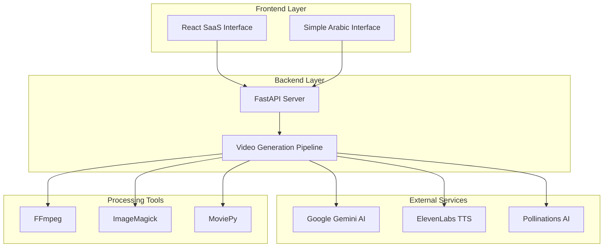
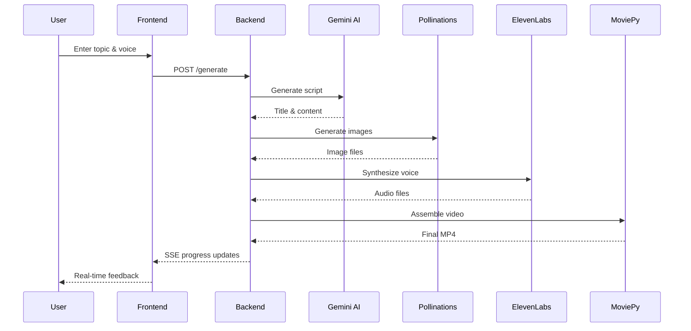

# Vidzyme Documentation

## 📚 Complete Documentation Suite

Welcome to the comprehensive documentation for Vidzyme, an AI-powered video generation SaaS platform. This documentation suite provides everything you need to understand, deploy, develop, and maintain the application.

## 📖 Documentation Overview

### 🏗️ [Project Overview](./PROJECT_OVERVIEW.md)
**Essential reading for understanding the platform**
- Complete system architecture and design
- Technology stack and component relationships
- 12-step video generation pipeline
- Key features and capabilities
- Performance characteristics and scalability
- Security considerations and internationalization

### 🔧 [Backend Architecture](./BACKEND_ARCHITECTURE.md)
**Deep dive into the FastAPI backend**
- FastAPI application structure and configuration
- Utility modules and their responsibilities
- API endpoint specifications and routing
- External service integrations (Gemini, ElevenLabs, Pollinations)
- Video processing pipeline with MoviePy
- Error handling and logging strategies
- Security implementation and performance optimizations

### 🎨 [Frontend Architecture](./FRONTEND_ARCHITECTURE.md)
**Comprehensive React SaaS interface guide**
- React + TypeScript + Vite + Tailwind CSS stack
- Component structure and organization
- State management patterns and navigation
- Authentication and user management
- Real-time progress tracking with SSE
- Responsive design and accessibility
- Performance optimizations and code splitting

### 🌐 [API Documentation](./API_DOCUMENTATION.md)
**Complete API reference and integration guide**
- All endpoint specifications with examples
- Request/response formats and validation
- Server-Sent Events for real-time updates
- Error handling and status codes
- External API integrations and configurations
- Testing examples and client implementations
- Future API enhancements and webhook support

### 🚀 [Deployment Guide](./DEPLOYMENT_GUIDE.md)
**Production-ready deployment strategies**
- Local development environment setup
- Docker containerization and orchestration
- Cloud deployment (AWS, GCP, Azure)
- SSL/TLS configuration and security hardening
- Monitoring, logging, and health checks
- Backup strategies and update procedures
- Troubleshooting common deployment issues

### 👨‍💻 [Development Guide](./DEVELOPMENT_GUIDE.md)
**Developer workflow and contribution guidelines**
- Development environment setup and tools
- Coding standards and best practices
- Testing strategies (unit, integration, e2e)
- Git workflow and branch management
- Code review process and quality assurance
- Performance guidelines and security practices
- Contributing guidelines and issue templates

## 🚀 Quick Start Guide

### For Users
1. Read the [Project Overview](./PROJECT_OVERVIEW.md) to understand the platform
2. Follow the [Deployment Guide](./DEPLOYMENT_GUIDE.md) for installation
3. Refer to the [API Documentation](./API_DOCUMENTATION.md) for integration

### For Developers
1. Start with the [Development Guide](./DEVELOPMENT_GUIDE.md) for environment setup
2. Study the [Backend Architecture](./BACKEND_ARCHITECTURE.md) and [Frontend Architecture](./FRONTEND_ARCHITECTURE.md)
3. Follow coding standards and contribution guidelines

### For DevOps/System Administrators
1. Focus on the [Deployment Guide](./DEPLOYMENT_GUIDE.md) for production setup
2. Review security configurations in [Backend Architecture](./BACKEND_ARCHITECTURE.md)
3. Implement monitoring strategies from the deployment documentation

## 🏗️ System Architecture Summary

## 🔄 Video Generation Pipeline

## 📋 Technology Stack

### Backend Technologies
- **Framework**: FastAPI (Python)
- **AI Integration**: Google Gemini 1.5 Flash
- **Text-to-Speech**: ElevenLabs API
- **Image Generation**: Pollinations AI
- **Video Processing**: MoviePy, FFmpeg, ImageMagick
- **Translation**: Google Translate
- **Server**: Uvicorn ASGI

### Frontend Technologies
- **Framework**: React 18 with TypeScript
- **Build Tool**: Vite
- **Styling**: Tailwind CSS
- **Icons**: Lucide React
- **State Management**: React Hooks
- **Real-time Updates**: Server-Sent Events

### Development & Deployment
- **Containerization**: Docker & Docker Compose
- **Cloud Platforms**: AWS, GCP, Azure
- **CI/CD**: GitHub Actions
- **Testing**: pytest (Backend), Jest (Frontend)
- **Code Quality**: Black, Flake8, ESLint, Prettier

## 🔐 Security Features

- **API Key Management**: Secure file-based storage
- **Input Validation**: Comprehensive parameter validation
- **Error Handling**: Graceful failure with user-friendly messages
- **CORS Configuration**: Proper cross-origin resource sharing
- **SSL/TLS Support**: Production-ready HTTPS configuration
- **Rate Limiting**: Future implementation for API protection

## 🌍 Internationalization

- **Primary Language**: English (SaaS interface)
- **Secondary Language**: Arabic (content creation)
- **RTL Support**: Right-to-left text direction
- **Unicode Support**: Full UTF-8 encoding
- **Font Support**: Arabic typography integration

## 📊 Performance Characteristics

- **Video Generation Time**: 2-3 minutes for 60-second videos
- **Concurrent Processing**: Single-threaded (expandable)
- **Memory Usage**: ~2GB during video processing
- **Storage Requirements**: ~100MB per generated video
- **API Response Time**: <200ms for simple endpoints

## 🔮 Future Enhancements

### Planned Features
- **User Authentication**: JWT-based authentication system
- **Video Templates**: Pre-designed video formats
- **Batch Processing**: Multiple video generation
- **Analytics Dashboard**: Usage and performance metrics
- **API Rate Limiting**: Production-grade request throttling
- **Database Integration**: Persistent data storage
- **Webhook Support**: Event-driven integrations

### Scalability Improvements
- **Microservices Architecture**: Service decomposition
- **Queue System**: Asynchronous job processing
- **CDN Integration**: Global content delivery
- **Load Balancing**: Multi-instance deployment
- **Caching Layer**: Redis-based caching

## 📞 Support and Community

### Getting Help
- **Documentation**: Start with this comprehensive guide
- **Issues**: Report bugs and request features on GitHub
- **Discussions**: Join community discussions for questions
- **Email**: Contact the development team for enterprise support

### Contributing
- **Code Contributions**: Follow the [Development Guide](./DEVELOPMENT_GUIDE.md)
- **Documentation**: Help improve and expand documentation
- **Testing**: Contribute test cases and quality assurance
- **Feedback**: Share your experience and suggestions

## 📄 License and Legal

- **License**: [Specify your license here]
- **Third-party Services**: Ensure compliance with API terms
- **Data Privacy**: Implement GDPR/CCPA compliance as needed
- **Content Rights**: Respect intellectual property in generated content

---

## 📚 Documentation Maintenance

This documentation is actively maintained and updated with each release. For the most current information:

- **Version**: 1.0.0
- **Last Updated**: January 2024
- **Next Review**: Quarterly updates
- **Feedback**: Submit documentation improvements via GitHub issues

**Happy coding! 🚀**